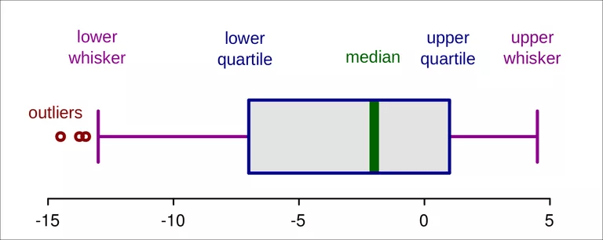
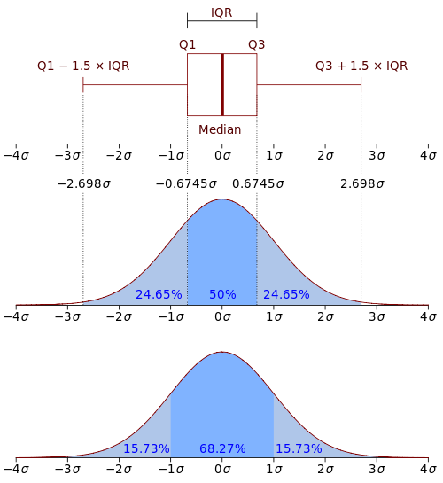

# Summaries of Data


```{r label="load-chap2", echo=FALSE, highlight=TRUE, message=F}

if (!requireNamespace("xfun")) install.packages("xfun")
library(xfun)

pkg_attach2("knitr", "tidyverse", "kableExtra")

wilcox <- new.env()
freeze <- ls()

```


The following text is not a complete excerpt or summary of chapter 2. On the one hand I will only write down those things that are new for me and were not coverend in other introductory statistics text books. On the other side I am exploring the presented concepts and at this occasion I will using and practicing R.

## Measures of Locations

### Definition and examples

The common description of a "measure of location" as a number intended to reflect the typical individual or thing under study is misleading. A more accurat definition is, that a measure of lcoation has to satisfy three properties (p.25):

* The value always lies between largest and smallest value inclusive.
* If all the values are multiplied by a constant, the value of the measures of location are multipled with this constand as well.
* If a constant is added to every value, then the measures of location is increased by this constant too. 

Measures of locations are:

#### The sample mean 

It is calculated with the built-in function `mean(x)`. This measure is very sensitive to outliers. 

> One way of quantifying the sensitivity of the sample mean to outliers is with the so-called _finite sample breakdown point_ … [which] is the smallest proportion of observations that can make it arbitrary large or small. Said another way, the finite sample breakdown point of the sample mean is the smallest proportion  of _n_ observations that can render it meaningless. A singe observation can make the sample mean arbitrarily large or small, regardless of what the other values might be, so its finite sample breakdown point is _1/n_. (p.19)


The name _breakdown point_ refers to the maximal amount of variation the measure can withstand before it breaks down, i.e. before it can take arbitrary values^[Perret-Gentil, C., & Victoria-Feser, M.-P. (2003). Financial Valuation and Risk Management Working Paper No. 173 Robust Mean-Variance Portfolio Selection Cédric]. 

#### The sample median {#median}

It is calculated with the built-in function `median(x)`. It is the most extreme example of a trimmed mean, e.g., a mean where as specified portion of the smallest and largest values are cut and not included in the computation of the average. The finite sample breakdown point for the median is approximately 0.5, the highest possible value. 

### Critical discussion

> Based on the single criterion of having a high breakown point, the median beats the mean. But is not beeing suggested that the mean is always inappropriate when extreme values occur (p.21).

Take for example an individual reporting that the median amount of earnings over a 10 year period is $100,000.This sounds good, but consider following income situation:

100,000, 100,000, 100,000, 100,000, 100,000, 100,000, 100,000, 100,000, 100,000, -1.000,000. At the end of the 10 year period the individuam has earned nothing but in fact lost 100,000. Here the long term amount of earning, as expressed in the mean, is important.


```{example, label= "rel-mean", cache=F, name="The mean is still relevant"}
```

```{r example-2.1, results='hold'}
x <- c(100000, 100000, 100000, 100000, 100000, 100000, 100000,
       100000, 100000, -1000000)
mean(x)
median(x)
```

Or take the daily rainfall in Boston, Massachusetts as another example for the appropriateness of the mean. The median is zero, because no rain is typical for Boston. But, of course, it does rain in Boston sometimes.

### Trimmed mean {#trimmed-mean}

The sample median represents the most extreme amout of trimming and might trim too many values. Therefore many times a trimmed mean performs better. Often a good choice for the routine use of a trimmed mean is 20%. In that case 20% of the lowest and highest data are cut, i.e., are not included in the caluation of the mean. 

For the R standard function `mean()` the default trim parameter is set to 0, which corresponds to the sample mean, e.g., no trimming is carried out. To get the desired 20% in the built-in function you have to specify `mean(x, trim=0.2)`, where the finite sample breakdown point is approximately 0.2^.In the book the argument mentioned for the R standard function is called wrongly `tr`.]

Wilcox provides `tmean()` especially written for the book, which has as it default trim parameter value 0.2. (`tmean(x, tr=.2)`)

```{theorem, label="title-tmean-function", name="Trimmed mean"}
```

```{r tmean-function}
with(wilcox, {
  tmean <- function(x,
                    tr = .2,
                    na.rm = FALSE,
                    STAND = NULL) {
    if (na.rm)
      x <- x[!is.na(x)]
    val <- mean(x, tr)
    val
  }
})
```


### Winsorized mean {#winsorized-mean}

Later in chapter 4 the so-called winsorized mean^[See the German explication for "winsorisieren": https://m.portal.hogrefe.com/dorsch/winsorisieren/] is needed. Instead of trimming a certain percentage of the lowest and highest data the winsorized mean set this percentage of data equal to the lowest respectively to the highest value which would have not be trimmed by the trim function. Again the finite sample breakdown point equals approximately the proportion of points winsorized.

```{theorem, label="title-winsorized-mean", name="Winsorized mean with supporting functions"}
```

```{r winsorized-mean}

with(wilcox, {
  winmean <- function(x, tr = .2, na.rm = TRUE) {
    if (na.rm)
      x = elimna(x)
    winmean <- mean(winval(x, tr))
    winmean
  }
  
  elimna <- function(m) {
    #
    # remove any rows of data having missing values
    #
    if (is.null(dim(m)))
      m <- as.matrix(m)
    ikeep <- c(1:nrow(m))
    for (i in 1:nrow(m))
      if (sum(is.na(m[i,]) >= 1))
        ikeep[i] <- 0
    elimna <- m[ikeep[ikeep >= 1], ]
    elimna
  }
  
  winval <- function(x, tr = .2) {
    #
    #  Winsorize the data in the vector x.
    #  tr is the amount of Winsorization which defaults to .2.
    #
    #  This function is used by several other functions that come with this book.
    #
    y <- sort(x)
    n <- length(x)
    ibot <- floor(tr * n) + 1
    itop <- length(x) - ibot + 1
    xbot <- y[ibot]
    xtop <- y[itop]
    winval <- ifelse(x <= xbot, xbot, x)
    winval <- ifelse(winval >= xtop, xtop, winval)
    winval
  }
  
})
```

```{example, cache=F, name="Compare mean, median, trimmed and winsorized mean"}


Values unsorted: $12, 45, 23, 79, 19, 92, 30, 58, 132, 1000$, 

Values sorted:   $12, 19, 23, 30, 45, 58, 79, 92, 132, 1000$.

The following demonstrations shows that the non-adapted mean is quite different from the median. It is almost three times bigger! You will get considerably better results with the trimmed mean and the winsorized mean.

But keep in mind that there are situation where the mean is still a very relevant measure (see Example \@ref(exm:rel-mean)).
```


```{lemma, cache=F, name="Comparison of mean, median, trimmed and winsorized mean"}
```

```{r compare-trim-winsorized-mean}

x_data <- c(12, 45, 23, 79, 19, 92, 30, 58, 132, 1000)
x_data_mean <- format(mean(x_data), nsmall = 2)
x_data_median <- format(median(x_data), nsmall = 2)
x_data_trim_mean <- format(mean(x_data, 0.2), nsmall = 2)
x_data_win_mean <-  with(wilcox, {format(
  winmean(x_data, 0.2), nsmall = 2)
  })

```


| Measure               | Value                  | Notes
|:----------------------|-----------------------:|:-----------------------------|
| Mean                  | `r x_data_mean`        | "`r sort(x_data)`"
| Median                | `r x_data_median`      |"12, 19, 23, 30, **45**, **58**, 79, 92, 132, 1000"
| 20% trimmed mean      | `r x_data_trim_mean`   | "[12, 19], `r sort(x_data)[3:8]`, [132, 1000]"
| 20% winsorized mean   | `r x_data_win_mean`    |"23, 23, 23, 30, 45, 58, 79, 92, 92, 92"

Table: (\#tab:compare-means) Comparison of mean, median, trimmed and winsorized mean


## Measures of Variance

Not all people are alike. Even objects of the same category have more or less slightly different features. In real life there is always variation. And it is exactly this inevitable variation which is the motivation for sophisticated statistical techniques. We need therefore appropriate measures of variation, which are also called measures of scale.

### Sample Variance and Standard Deviation

* **The sample variance $s^{2}$:** Substract the sample mean from each observations and square them. Add all differences and divide by the number of observation mminus one. The build-in R function is $var(x)$.
* **The sample standard deviation $s$:** It is the positive square root of the sample variance. The build-in R function is $sd(x)$.

The sample variance is not resistent to outliers: A single unusual value can inflate the sample variance and give a misleading figure.

### The Interquartile Range

#### How to construct the IQR?

Another measure of dispersion, which is particularily used when the goal is to detect outliers, is called the interquartile range (IQR). The IQR reflects the range of values among the middle 50% of the data.

The usual way to compute it is by removing the smallest and largest 25% of the data. Then we take the difference between the largest (`q1`) und smallest (`q2`) values remaining. $q2$ and $q1$ are called lower and upper _quartiles_ respecitvely. 

There are many alternative proposals for the computation of the IQR, slightly altering the calculation of the sample quantiles. The help page in R for sample quantiles records nine different types. 

#### Calculation of the _ideal fourth_

A more complicated calculation uses the so-called lower and upper _ideal fourth_.

```{definition, label="ideal-fourth", cache=F, name="Ideal fourth"}

$$q_{1} = (1 -h)X_{j} + hX_{j+1}$$

where $j$ is the integer portion of $(n/4) + (5/12)$, meaning that $J$ is $(n/4) + (5/12)$ rounded down to the nearest integer, and

$$h = \frac{n}{4} + \frac{5}{12} - j$$

The upper ideal fourth is:

$$q_{2} = (1 -h)X_{k} + hX_{k-1}$$

where $k = n - j + 1$ in which case the interquartile range is:

$$IQR = q_{2} - q_{1}$$
```


```{example, cache=F, name="Calculation of the ideal fourth"}


Wilcox shows the process of the computation with the following 12 values: $-29.6, -20.9, -19.7, -15.4, -8.0, -4.3, 0.8, 2.0, 6.2, 11.2, 25.0$

$$\frac{n}{4} + \frac{5}{12} = $$
$$\frac{12}{4} + \frac{5}{12} = $$
$$\frac{36}{12} + \frac{5}{12} = $$
$$\frac{41}{12} = 3.41667$$

Rounding 3.41667 to the nearest integer = `r round(3.41667)`, so h = 3.41667 - 3 = 0.41667. Because $X_{3} = -19.7$ and $X_{4} = -15.4$ we get

$$q_{1} = (1-0.41667)(-19.7) + 0.41667(-15.4) = -17.9$$
and

$$q_{2} = (1-0.41667)(-6.2) + 0.41667(2.0) = 4.45$$
So the interquartile range, based on the ideal fourth is

$$IQR = 4.45 - (-17.9) = 22.35$$

```

#### Comparison of different IQR computations

With `idealf(x)` respectively `idealfIQR` using the ideal fourths a tenth function was especially written for the Wilcox book. To use this Wilcox measure I had to copy and load the corresponding functions `idealf`, `idealfIQR` from the `Software/Rallfun-v36.txt` and additionally `elimna` (called by `idealfIQR`), which is only located on the github version of [WRS2](https://github.com/cran/WRS2/blob/master/R/elimna.R).


```{lemma, cache=F, name="Function to calculate the ideal fourth"}
```


```{r load-idealf}

with(wilcox, {
  idealf <- function(x, na.rm = FALSE) {
    #
    # Compute the ideal fourths for data in x
    #
    if (na.rm)
      x <- x[!is.na(x)]
    j <- floor(length(x) / 4 + 5 / 12)
    y <- sort(x)
    g <- (length(x) / 4) - j + (5 / 12)
    ql <- (1 - g) * y[j] + g * y[j + 1]
    k <- length(x) - j + 1
    qu <- (1 - g) * y[k] + g * y[k - 1]
    list(ql = ql, qu = qu)
  }
  
  idealfIQR <- function(x) {
    #
    #  Compute the interquartile range using the ideal fourths.
    x = elimna(x)
    res = idealf(x)$qu - idealf(x)$ql
    res
  }
  
})

```


```{example, cache=F, name="Compare different types of quantiles and IQRs"}
```

```{r data-to-compare-quantiles}

q <-  c(-29.6, -20.9, -19.7, -15.4, -12.3, -8.0, -4.3, 
        0.8, 2.0, 6.2, 11.2, 25.0)

```


| Function    | Quantiles: 25%, 75%                 | IQR               |
|:------------|------------------------------------:|------------------:|
| IQR, Type 1 | `r format(quantile(q,c(0.25,0.75),type=1),nsmall=2)` | `r format(IQR(q,type=1),nsmall=2)` |
| IQR, Type 2 | `r format(quantile(q,c(0.25,0.75),type=2),nsmall=2)` | `r format(IQR(q,type=2),nsmall=2)` |
| IQR, Type 3 | `r format(quantile(q,c(0.25,0.75),type=3),nsmall=2)` | `r format(IQR(q,type=3),nsmall=2)` |
| IQR, Type 4 | `r format(quantile(q,c(0.25,0.75),type=4),nsmall=2)` | `r format(IQR(q,type=4),nsmall=2)` |
| IQR, Type 5 | `r format(quantile(q,c(0.25,0.75),type=5),nsmall=2)` | `r format(IQR(q,type=5),nsmall=2)` |
| IQR, Type 6 | `r format(quantile(q,c(0.25,0.75),type=6),nsmall=2)` | `r format(IQR(q,type=6),nsmall=2)` |
| IQR, Type 7 | `r format(quantile(q,c(0.25,0.75),type=7),nsmall=2)` | `r format(IQR(q,type=7),nsmall=2)` |
| IQR, Type 8 | `r format(quantile(q,c(0.25,0.75),type=8),nsmall=2)` | `r format(IQR(q,type=8),nsmall=2)` |
| IQR, Type 9 | `r format(quantile(q,c(0.25,0.75),type=9),nsmall=2)` | `r format(IQR(q,type=9),nsmall=2)` |
| idealf / idealfIQR| `r with(wilcox, {format(idealf(q)$ql,nsmall=2)})`, `r with(wilcox, {format(idealf(q)$qu,nsmall=2)})`                 | `r with(wilcox, {format(idealfIQR(q),nsmall=2)})`  |

Table: (\#tab:IQR-types) Comparison of the different types for IQR computation

The table compares the different computation for the IQR. R uses as standard `type = 7`. Note that `type = 8` corresponds exactly to the ideal fourth calculation.

### Winsorized Variance

When working with the trimmed mean, than the winsorized variance plays an important role. The winsorized variance is just the sample variance of the winsorized values. Its finite sample breakdown point is equal to the amount winsorized.

The R function `winvar` is especially written for the book and takes of its default 0.2. `winvar(x, tr = 0.2, na.rm = FALSE, STAND = NULL)`^[The parameter `STAND` has no functionality, it is only kept for WRS compatibility purposes.]

```{theorem, label="title-winsorized-variance", name="Winsorized Variance"}
```
```{r winsorized-variance}
with(wilcox, {
  winvar <- function(x,
                     tr = .2,
                     na.rm = FALSE,
                     STAND = NULL) {
    #
    #  Compute the gamma Winsorized variance for the data in the vector x.
    #  tr is the amount of Winsorization which defaults to .2.
    #
    remx = x
    x <- x[!is.na(x)]
    y <- sort(x)
    n <- length(x)
    ibot <- floor(tr * n) + 1
    itop <- length(x) - ibot + 1
    xbot <- y[ibot]
    xtop <- y[itop]
    y <- ifelse(y <= xbot, xbot, y)
    y <- ifelse(y >= xtop, xtop, y)
    wv <- var(y)
    if (!na.rm)
      if (sum(is.na(remx) > 0))
        wv = NA
    wv
  }
})
```


```{example cache=F, name="Calcuation of the Winsorized Variance"}
```


```{r winvar-example}
x_data <- c(12, 45, 23, 79, 19, 92, 30, 58, 132)
var_win_0.2 <- with(wilcox, {format(winvar(x_data), nsmall = 2)})
var_win_0.0 <- with(wilcox, {format(winvar(x_data, tr = 0), nsmall = 2)})
var_std <-  format(var(x_data), nsmall = 2)

```

The default 20% winsorized variance calculated with `winvar(x)` = **`r var_win_0.2`**. The standard sample variance _s^2^_ is `var(x)` = **`r var_std`** and this is exactly the value one gets calculated with `winvar(x, tr = 0)` = **`r var_win_0.0`**. Typically the winsorized variance is smaller than the sample variance _s^2^_ calculated with `var(x)`, because winsorizing pulls in extreme values. 

### Median Absolute Deviation (MAD)

The median absolute deviation (MAD) is another measure of dispersions and plays an important role when trying to detect outliers. 


```{definition label="MAD", cache=F, name="Median Absolute Deviation (MAD)"}

There are three steps for its calculation. I will demonstrate these three steps with the figures from the example above,. eg., with the values $12, 45, 23, 79, 19, 92, 30, 58, 132$:
  

1. Compute the sample Median _M_. (After sorting the values $12, 19, 23, 30, 45, 58, 79, 92, 132$ you get  _M_ = 45.
2. Substract this value ($45$) from every observed value and take the aboslute value. (For instance:
$X_1 - M = |12 - 45| = 33$ and $|X_2 - M| = 0$. All values are: $33, 0, 22, 34, 26, 47, 15, 13, 87$.)
3. MAD is the median of this new list of values: $26$.

```


For reasons related to the normal distribution, MAD is typically corrected by a certain factor, namely multiplied by $0.6745$ or divided by $1.4826$. To differentiate this value form the uncorrected `MAD` it is sometimes called `MADN`.

R has a built-in function `mad()` which calculates MADN.

```{example, label="calc-mad", cache=F, name="Calculation of the Median Absolute Deviation with `mad`"}
```


```{r calculate-madn}
x_data <- c(12, 45, 23, 79, 19, 92, 30, 58, 132)
x_mad <- mad(x_data)
x_madn1 <- mad(x_data) * 0.6745
x_madn2 <- mad(x_data) / 1.4826
```

The calculated MAD = **`r format(x_mad, nsmall=2)`** but to get MADN this value is divided by the factor `1.4826`, resulting in **`r format(x_madn2, nsmall=2)`** exactly ---  or as mentioned in the Wilcox book --- multiplied by `0.6745` with the same value of **`r format(x_madn1, nsmall=2)`**.

### Other robust measures of variation

There are many (~ 150) other measures of dispersion. Two well performing measures are the _biweight midvariance_ and the _percentage bend midvariance_. More recently some new measures have been proposed, such as the _translated biweight S (TBS)_ estimator^[I couldn't find the TBS measure of variation `tbsvar()` in any of the packages recommended in the book. But maybe it is included in the C-version, which I didn't manage to download.] and the _tau measure of scale_.

In contrast to the other measures already described, these new measures follow a different approach: Basically MAD or winsorized variance consider only the middle portion of the data whereas the four measures mentioned in this section try to detect outliers and then to discard them from the calculation.

The R-functions for these measures are: 

* Percentage Bend Midvariance: `pbvar()`
* Biweight Midvariance: `bivar()`
* Tau measure of scale: `tauvar()`
* Translated Biweight S: `(tbs())$var`

```{lemma, label="other-disp-measures", cache=F, name="Other dispersion measures"}
```

```{r other_dispersions-measures}


pbvar <- function(x, beta = .2) {
  #   Compute the percentage bend midvariance
  #
  #   beta is the bending constant for omega sub N.
  #
  pbvar = 0
  x = elimna(x)
  w <- abs(x - median(x))
  w <- sort(w)
  m <- floor((1 - beta) * length(x) + .5)
  omega <- w[m]
  if (omega > 0) {
    y <- (x - median(x)) / omega
    z <- ifelse(y > 1, 1, y)
    z <- ifelse(z < (-1), -1, z)
    pbvar <-
      length(x) * omega ^ 2 * sum(z ^ 2) / (length(x[abs(y) < 1])) ^
      2
  }
  pbvar
}


bivar <- function(x) {
  # compute biweight midvariance of x
  m <- median(x)
  u <- abs((x - m) / (9 * qnorm(.75) * mad(x)))
  av <- ifelse(u < 1, 1, 0)
  top <- length(x) * sum(av * (x - m) ^ 2 * (1 - u ^ 2) ^ 4)
  bot <- sum(av * (1 - u ^ 2) * (1 - 5 * u ^ 2))
  bi <- top / bot ^ 2
  bi
}


tauloc <- function(x, cval = 4.5) {
  #
  # Compute the tau measure of location as described in
  # Yohai and Zamar (JASA, 83, 406-413).
  #
  x <- elimna(x)
  s <- qnorm(.75) * mad(x)
  y <- (x - median(x)) / s
  W <- (1 - (y / cval) ^ 2) ^ 2
  flag <- (abs(W) > cval)
  W[flag] <- 0
  val <- sum(W * x) / sum(W)
  val
}

tauvar <- function(x, cval = 3) {
  #
  # Compute the tau measure of scale as described in
  # Yohai and Zamar (JASA, 1988, 83, 406-413).
  # The computational method is described in Maronna and Zamar
  # (Technometrics, 2002, 44, 307-317)
  #  see p. 310
  #
  x <- elimna(x)
  s <- qnorm(.75) * mad(x)
  y <- (x - tauloc(x)) / s
  cvec <- rep(cval, length(x))
  W <- apply(cbind(y ^ 2, cvec ^ 2), 1, FUN = "min")
  val <- s ^ 2 * sum(W) / length(x)
  val
}


tbs <- function(x,
                eps = 1e-3,
                maxiter = 20,
                r = .45,
                alpha = .05,
                init.est = OGK) {
  #        Rocke's contrained s-estimator
  #
  #      r=.45 is the breakdown point
  #      alpha=.05 is the asymptotic rejection probability.
  #
  library(MASS)
  x <- elimna(x)
  x = as.matrix(x)
  n <- nrow(x)
  p <- ncol(x)
  LIST = FALSE
  if (p == 1) {
    LIST = T
    p = 2
    x = cbind(x, rnorm(nrow(x)))
    # Yes, this code is odd, but for moment easiest way of handling p=1
  }
  temp <- init.est(x)
  #  very poor outside rate per obs under normality.
  t1 <- temp$center
  s <- temp$cov
  c1M <- cgen.bt(n, p, r, alpha, asymp = FALSE)
  c1 <- c1M$c1
  if (c1 == 0)
    c1 <- .001 #Otherwise get division by zero
  M <- c1M$M
  b0 <- erho.bt(p, c1, M)
  crit <- 100
  iter <- 1
  w1d <- rep(1, n)
  w2d <- w1d
  while ((crit > eps) & (iter <= maxiter))
  {
    t.old <- t1
    s.old <- s
    wt.old <- w1d
    v.old <- w2d
    d2 <- mahalanobis(x, center = t1, cov = s)
    d <- sqrt(d2)
    k <- ksolve.bt(d, p, c1, M, b0)
    d <- d / k
    w1d <- wt.bt(d, c1, M)
    w2d <- v.bt(d, c1, M)
    t1 <- (w1d %*% x) / sum(w1d)
    s <- s * 0
    for (i in 1:n)
    {
      xc <- as.vector(x[i, ] - t1)
      s <- s + as.numeric(w1d[i]) * (xc %o% xc)
    }
    s <- p * s / sum(w2d)
    mnorm <- sqrt(as.vector(t.old) %*% as.vector(t.old))
    snorm <- eigen(s.old)$values[1]
    crit1 <- max(abs(t1 - t.old))
    #        crit <- max(crit1,crit2)
    crit <- max(abs(w1d - wt.old)) / max(w1d)
    iter <- iter + 1
  }
  if (LIST) {
    v1 = t1[1]
    v2 = s[1, 1]
    return(list(center = v1, var = v2))
  }
  if (!LIST)
    return(list(center = t1, cov = s))
}

OGK <- function(x,
                niter = 2,
                beta = .9,
                control) {
  #
  #  OGK estimator via the R package rrcov
  #
  library(rrcov)
  v = CovOgk(x, niter = niter, beta = beta, control)
  list(center = v@center, cov = v@cov)
}

cgen.bt <- function(n, p, r, alpha, asymp = FALSE) {
    #   find constants c1 and M that gives a specified breakdown r
    #   and rejection point alpha
    if (asymp == FALSE) {
        if (r > (n - p) / (2 * n))
            r <- (n - p) / (2 * n)
    }
    # maximum achievable breakdown
    #
    #   if rejection is not achievable, use c1=0 and best rejection
    #
    limvec <- rejpt.bt.lim(p, r)
    if (1 - limvec[2] <= alpha)
    {
        c1 <- 0
        M <- sqrt(qchisq(1 - alpha, p))
    }
    else
    {
        c1.plus.M <- sqrt(qchisq(1 - alpha, p))
        M <- sqrt(p)
        c1 <- c1.plus.M - M
        iter <- 1
        crit <- 100
        eps <- 1e-5
        while ((crit > eps) & (iter < 100))
        {
            deps <- 1e-4
            M.old <- M
            c1.old <- c1
            er <- erho.bt(p, c1, M)
            fc <- er - r * (M ^ 2 / 2 + c1 * (5 * c1 + 16 * M) / 30)
            fcc1 <- (erho.bt(p, c1 + deps, M) - er) / deps
            fcM  <- (erho.bt(p, c1, M + deps) - er) / deps
            fcp <- fcM - fcc1 - r * (M - (5 * c1 + 16 * M) / 30 + c1 * 9 / 30)
            M <- M - fc / fcp
            if (M >= c1.plus.M) {
                M <- (M.old + c1.plus.M) / 2
            }
            c1 <- c1.plus.M - M
            #        if (M-c1 < 0)  M <- c1.old+(M.old-c1.old)/2
            crit <- abs(fc)
            iter <- iter + 1
        }
    }
    list(c1 = c1, M = M, r1 = r)
}

rejpt.bt.lim <- function(p, r) {
    #   find p-value of translated biweight limit c
    #   that gives a specified breakdown
    c1 <- 2 * p
    iter <- 1
    crit <- 100
    eps <- 1e-5
    while ((crit > eps) & (iter < 100))
    {
        c1.old <- c1
        fc <- erho.bt.lim(p, c1) - c1 ^ 2 * r
        fcp <- erho.bt.lim.p(p, c1) - 2 * c1 * r
        c1 <- c1 - fc / fcp
        if (c1 < 0)
            c1 <- c1.old / 2
        crit <- abs(fc)
        iter <- iter + 1
    }
    return(c(c1, pchisq(c1 ^ 2, p), log10(1 - pchisq(c1 ^ 2, p))))
}

erho.bt.lim <- function(p, c1)
  #   expectation of rho(d) under chi-squared p
  return(chi.int(p, 2, c1) + c1 ^ 2 * chi.int2(p, 0, c1))

chi.int.p <- function(p, a, c1)
  return(exp(lgamma((p + a) / 2) - lgamma(p / 2)) * 2 ^ {
    a / 2
  } * dchisq(c1 ^ 2, p + a) * 2 * c1)


chi.int2.p <- function(p, a, c1)
  return(-exp(lgamma((p + a) / 2) - lgamma(p / 2)) * 2 ^ {
    a / 2
  } * dchisq(c1 ^ 2, p + a) * 2 * c1)

out <- function(x,
                cov.fun = cov.mve,
                xlab = "X",
                ylab = "Y",
                qval = .975,
                crit = NULL,
                plotit = FALSE,
                ...) {
  #
  #  Search for outliers using robust measures of location and scatter,
  #  which are used to compute robust analogs of Mahalanobis distance.
  #
  #  x is an n by p matrix or a vector of data.
  #
  #  The function returns the values flagged as an outlier plus
  #  the (row) number where the data point is stored.
  #  If x is a vector, out.id=4 indicates that the fourth observation
  #  is an outlier and outval=123 indicates that 123 is the value.
  #  If x is a matrix, out.id=4 indicates that the fourth row of
  #  the matrix is an outlier and outval reports the corresponding
  #  values.
  #
  #  The function also returns the distance of the
  #  points identified as outliers
  #  in the variable dis.
  #
  #  For bivariate data, if plotit=TRUE, plot points and circle outliers.
  #
  #  cov.fun determines how the measure of scatter is estimated.
  #  Possible choices are
  #  cov.mve (the MVE estimate)
  #  cov.mcd (the MCD estimate)
  #  covmba2 (the MBA or median ball algorithm)
  #  rmba  (an adjustment of MBA suggested by D. Olive)
  #  cov.roc (Rocke's TBS estimator)
  #
  #  plotit=FALSE used to avoid problems when other functions in WRS call
  #  this function
  #
  library(MASS)
  oldSeed <- .Random.seed
  set.seed(12)
  if (is.data.frame(x))
    x = as.matrix(x)
  if (is.list(x))
    stop("Data cannot be stored in list mode")
  nrem = nrow(as.matrix(x))
  if (!is.matrix(x)) {
    dis <- (x - median(x, na.rm = TRUE)) ^ 2 / mad(x, na.rm = TRUE) ^ 2
    if (is.null(crit))
      crit <- sqrt(qchisq(.975, 1))
    vec <- c(1:length(x))
  }
  if (is.matrix(x)) {
    mve <- cov.fun(elimna(x))
    dis <- mahalanobis(x, mve$center, mve$cov)
    if (is.null(crit))
      crit <- sqrt(qchisq(.975, ncol(x)))
    vec <- c(1:nrow(x))
  }
  dis[is.na(dis)] = 0
  dis <- sqrt(dis)
  chk <- ifelse(dis > crit, 1, 0)
  id <- vec[chk == 1]
  keep <- vec[chk == 0]
  if (is.matrix(x)) {
    if (ncol(x) == 2 && plotit) {
      plot(x[, 1],
           x[, 2],
           xlab = xlab,
           ylab = ylab,
           type = "n")
      flag <- rep(TRUE, nrow(x))
      flag[id] <- FALSE
      points(x[flag, 1], x[flag, 2])
      if (sum(!flag) > 0)
        points(x[!flag, 1], x[!flag, 2], pch = "*")
    }
  }
  if (!is.matrix(x))
    outval <- x[id]
  if (is.matrix(x))
    outval <- x[id, ]
  n = nrow(as.matrix(x))
  n.out = length(id)
  assign(x = '.Random.seed',
         value = oldSeed,
         envir = .GlobalEnv)
  list(
    n = n,
    n.out = n.out,
    out.val = outval,
    out.id = id,
    keep = keep,
    dis = dis,
    crit = crit
  )
}


outtbs <- function(x,
                   SEED = FALSE,
                   plotit = TRUE,
                   xlab = "X",
                   ylab = "Y",
                   ...) {
  #
  # Use the tbs estimator to
  # determine which points are outliers
  #
  if (!is.matrix(x))
    stop("x should be a matrix")
  x <- elimna(x)
  temp <- out(
    x,
    cov.fun = tbs,
    plotit = plotit,
    SEED = SEED,
    xlab = xlab,
    ylab = ylab
  )
  outid <- temp$out.id
  keep <- temp$keep
  list(out.id = outid,
       keep = keep,
       distances = temp$dis)
}


elimna <- function(m) {
  #
  # remove any rows of data having missing values
  #
  if (is.null(dim(m)))
    m <- as.matrix(m)
  ikeep <- c(1:nrow(m))
  for (i in 1:nrow(m))
    if (sum(is.na(m[i,]) >= 1))
      ikeep[i] <- 0
  elimna <- m[ikeep[ikeep >= 1], ]
  elimna
}


############################################################

```


```{example, label="comp-disp-measures", cache=F, name="Comparison of other robust measures of variation"}
```


```{r comp-dispersion-measures}


vecs <- list(c("Vector W", "Vector X", "Vector Y", "Vector Z"))
measures <- list(c("pbvar", "bivar", "tauvar", "tbs"))
vars <- list(c("V1","V2","V3","V4","V5","V6","V7","V8","V9"))

m1 <- matrix(c(12, 45, 23, 79, 19, 92, 30, 58, 132,
              12, 45, 23, 79, 19, 92, 30, 58, 1000,
              12, 45, 23, 79, 19, 1000, 30, 58, 1000,
              12, 45, 23, 1000, 19, 1000, 30, 58, 1000),
            nrow = 4, ncol = 9, byrow = TRUE,
            dimnames = c(vecs, vars))

m2 <- matrix(data = NA, nrow = 4, ncol = 4, byrow = FALSE,
             dimnames = c(vecs, measures))

for (i in c("pbvar", "bivar", "tauvar")) {
  for (j in 1:4) {
  m2[,i] <- apply(m1, 1, i)
  }
}

# special treatment of tbs as it does not return a single value but a list
# the same program lines gives different results! Why?

for (j in 1:4) {
  m2[j, 4] <- tbs(m1[j, ])$var
}
m <-  cbind(m1, m2)
m %>%
  kable(caption = "Comparison of other robust measures of variation",
      label = "other-disp-measure") %>%
  kable_styling(bootstrap_options =
                  c("striped", "hover", "condensed", "responsive"),
                  font_size = 14, full_width = TRUE) %>%
  column_spec(11:14, bold = T, color = "white", background = "gray")

```

For the following interpretation we are not interested in the magnitude of these dispersion measures, because we only want to compare their pperformance them with the different size and number of outliers in the four vectors W, X, Y, Z.

This table demonstrates: 

1. The `pbvar()` ignores with the default parameter of the bending constand of 0.2 the two largest and smallest values. Therefore it is completely robust with two outliers and does not change its value. But with more than two outliers on one side (small or large) its performance cause havoc: The value of pbvar in the `Vector Z`-colummn is strikingly different from the other values. In that case the bending constant has to be enlarged. For instance: Changing the constant from .2 to .3 results in `pbvar()` values of 2128 for all four vectors.
2. The `bivar()` value is for the `Vector W` similar to the percentage bend midvariance `pbvar()`. But increasing the largest value 132 and adding more outliers it decreases! The reason is that `bivar()` has 132 not detected as an outlier in contrast to 1000 which values are subsequently ignored.
3. The `tauvar` is robust with one to two outliers of one side of the spectrum (small or large). With more than two small or large outliers it increases, but in moderate paces.
4. The `(tbs())$var` results only in slightly changes with different size and numbers of outliers. One thing I do not understand: Whenever the program is executed the values for the `tbs` differ somewhat.


### Some comments on measures of variaton

Several methods of measuring the dispersion have been described. But: which one should be used? The answer depends in part of the type of problem and will be addressed in the subsequent chapters.


## Detecting outliers

Detecting unusally large or small values can be very important. The standard methods based on the sample mean and variance are sometimes highly unsatisfactory.


### Mean and variance based method

Declare as outliers all values that are more than two standard deviations away from the mean. The reason why the factor two is used, will be covered in the next chapter.

```{definition, label="std-method", cache=F, name="Method for detecting outliers based on the mean and the variance"}
```

$$\frac{|X - \bar{X}|}{s} > 2.$$ 

This formula works fine in some cases notably if there are not many outliers inflating the sample mean and especially the sample standard deviation. The following three examples will demonstrate one problem of outlier detection, called _masking_.

```{lemma, cache=F, name="Demonstration data for masking of outliers"}
```

```{r outlier-detection-mean-variance}

x.out <-  c(2, 2, 2, 2, 2, 3, 3, 3, 3, 3, 4, 4, 4, 4, 4, 1000)
y.out <- c(x.out, 10000)
z.out <- c(2, 2, 3, 3, 3, 4, 4, 4, 100000, 100000)

```


To demonstrate _masking_ Wilcox has prepared three different sets of data.

* **x.out** has one outlier: "2, 2, 2, 2, 2, 3, 3, 3, 3, 3, 4, 4, 4, 4, 4, 1000"
* **y.out** has one "normal" and one extrem outlier: "2, 2, 2, 2, 2, 3, 3, 3, 3, 3, 4, 4, 4, 4, 4, 1000, 10000"
* **z.out** has two extrem outliers: "2, 2, 2, 2, 2, 3, 3, 3, 3, 3, 4, 4, 4, 4, 4, 100000, 100000"

| # | Vector   | Outlier | **$\bar{X}$**   | **$s$**        | $> 2 sd?$                  |
|--:|:---------|--------:|----------------:|---------------:|-------------------------:|
| 1 | $x.out$  | 10^3^   | `r mean(x.out)` | `r sd(x.out)`  | `r abs(1000 - mean(x.out)) / sd(x.out)`
| 2 | $y.out1$| 10^3^   | `r mean(y.out)` | `r sd(y.out)`  | `r abs(1000 - mean(y.out)) / sd(y.out)`
| 3 | $y.out2$| 10^4^   | `r mean(y.out)` | `r sd(y.out)`  | `r abs(10000 - mean(y.out)) / sd(y.out)`
| 4 | $z.out$  | 10^5^   | `r mean(z.out)` | `r sd(z.out)`  | `r abs(100000 - mean(z.out)) / sd(z.out)`

Table: (\#tab:masking-outliers) Demonstrating the masking of outliers

* **Line 1:** The value is > 2 sample standard deviation = correct detection of outlier.
* **Line 2, 3:** The smaller outlier is masked by another more extreme outlier = no detection of the smaller outlier.
* **Line 4:** Both extreme outlier are not detected!

### The MAD-Median rule {#mad-median-rule}

The MAD-Median rule declares X as an outlier if

```{definition, label="mad-median", cache=F, name="The MAD-Median rule"}
```
$$\frac{|X - M|}{MADN} > 2.24$$

If we now substitute the formula above with the values of line 4, we get `r (100000 - median(z.out)) / mad(z.out)`, which is much bigger than 2.24. So in this case both outliers are detected correctly.

### R function `out(x)`

Wilcox suggests in his book the new programmed function `out(x)` for detecting outliers without the masking problem. 

```{lemma, cache=F, name="outlier function `out(x)`"}
```

```{r out-function-detecting-outliers}

with(wilcox, {
  out <- function(x,
                  cov.fun = cov.mve,
                  xlab = "X",
                  ylab = "Y",
                  qval = .975,
                  crit = NULL,
                  plotit = FALSE,
                  ...) {
    #
    #  Search for outliers using robust measures of location and scatter,
    #  which are used to compute robust analogs of Mahalanobis distance.
    #
    #  x is an n by p matrix or a vector of data.
    #
    #  The function returns the values flagged as an outlier plus
    #  the (row) number where the data point is stored.
    #  If x is a vector, out.id=4 indicates that the fourth observation
    #  is an outlier and outval=123 indicates that 123 is the value.
    #  If x is a matrix, out.id=4 indicates that the fourth row of
    #  the matrix is an outlier and outval reports the corresponding
    #  values.
    #
    #  The function also returns the distance of the
    #  points identified as outliers
    #  in the variable dis.
    #
    #  For bivariate data, if plotit=TRUE, plot points and circle outliers.
    #
    #  cov.fun determines how the measure of scatter is estimated.
    #  Possible choices are
    #  cov.mve (the MVE estimate)
    #  cov.mcd (the MCD estimate)
    #  covmba2 (the MBA or median ball algorithm)
    #  rmba  (an adjustment of MBA suggested by D. Olive)
    #  cov.roc (Rocke's TBS estimator)
    #
    #  plotit=FALSE used to avoid problems when other functions in WRS call
    #  this function
    #
    library(MASS)
    oldSeed <- .Random.seed
    set.seed(12)
    if (is.data.frame(x))
      x = as.matrix(x)
    if (is.list(x))
      stop("Data cannot be stored in list mode")
    nrem = nrow(as.matrix(x))
    if (!is.matrix(x)) {
      dis <- (x - median(x, na.rm = TRUE)) ^ 2 / mad(x, na.rm = TRUE) ^ 2
      if (is.null(crit))
        crit <- sqrt(qchisq(.975, 1))
      vec <- c(1:length(x))
    }
    if (is.matrix(x)) {
      mve <- cov.fun(elimna(x))
      dis <- mahalanobis(x, mve$center, mve$cov)
      if (is.null(crit))
        crit <- sqrt(qchisq(.975, ncol(x)))
      vec <- c(1:nrow(x))
    }
    dis[is.na(dis)] = 0
    dis <- sqrt(dis)
    chk <- ifelse(dis > crit, 1, 0)
    id <- vec[chk == 1]
    keep <- vec[chk == 0]
    if (is.matrix(x)) {
      if (ncol(x) == 2 && plotit) {
        plot(x[, 1],
             x[, 2],
             xlab = xlab,
             ylab = ylab,
             type = "n")
        flag <- rep(TRUE, nrow(x))
        flag[id] <- FALSE
        points(x[flag, 1], x[flag, 2])
        if (sum(!flag) > 0)
          points(x[!flag, 1], x[!flag, 2], pch = "*")
      }
    }
    if (!is.matrix(x))
      outval <- x[id]
    if (is.matrix(x))
      outval <- x[id,]
    n = nrow(as.matrix(x))
    n.out = length(id)
    assign(x = '.Random.seed',
           value = oldSeed,
           envir = .GlobalEnv)
    list(
      n = n,
      n.out = n.out,
      out.val = outval,
      out.id = id,
      keep = keep,
      dis = dis,
      crit = crit
    )
  }
})
```

```{lemma, cache=F, name="Demonstrate results of function `out(x)`"}
```

```{r}
# options(tinytex.verbose = TRUE)
with(wilcox, {
  out(z.out)
})
```


`out(x)` returns a list, where I do not understand all parameter as explained in the comment inside the function. But `$out.val` returns the value all outliers and `out.id` the positions of the outliers within the vector. Trying with the above example of `z.out`: 

* Number of detected outliers: `r with(wilcox, {out(z.out)$n.out})`
* The detected outliers are: `r with(wilcox, {out(z.out)$out.val})` 
* Position of detected outliers: `r with(wilcox, {out(z.out)$out.id})`.

The function `out(x)` detects both outliers and avoids _masking_.

### Boxplot rule

Another method to detect outlier is a graphical summary provided by a boxplot.
To get the graphic with `bookdown` displayed I use the folloring code snippet:

```{lemma, cache=F, name="How to display the following external image file?"}
```


````markdown
`r ''````{r label="boxplot", out.width="100%",
          echo=FALSE, fig.align="center",
          fig.cap="Detecting outliers with boxplot graphics
          (Ruediger85/CC-BY-SA-3.0/Wikimedia Commons)"}

```
````


```{r label="boxplot", out.width="100%", echo=FALSE, fig.align="center", fig.cap="Detecting outliers with boxplot graphics (Ruediger85/CC-BY-SA-3.0/Wikimedia Commons)"}

```


The end of the whiskers are the smallest and largest values not declared outliers and are called _adjacent values_. Because the IQR has finite sample breakdown point of 0.25. more than 25% of the data must be outliers before the problem of masking occurs.

The bloxplot declares outliers if their positions is more than 1.5 IQRs from the lower respectively from the upper quartile.

```{definition, label="boxplot-outliers", cache=F, name="How bloxpots declare outliers"}

```

$$X < q1 - 1.5(IQR)$$

or 

$$X < q1 + 1.5(IQR)$$

For a better understanding of the boxplot measures a comparison with the probability density function of a normal distribution may be helpful:


```{r label="boxplot-PDF", out.width="70%", echo=FALSE, fig.align="center", fig.cap="Boxplots in relation to the Probability Density Function (PDF). By Jhguch at en.wikipedia, CC BY-SA 2.5, https://commons.wikimedia.org/w/index.php?curid=14524285"}

```


There is a built-in R function `boxplot(x)`. For a demonstration I will use the `rivers` data again. 


```{lemma, cache=F, name="Demonstration of the built-in R function `boxplot(x)`"}
```


```{r boxplot-graphics, fig.cap="Demonstration of the build-in R function `boxplot(x)` with the rivers data = length of rivers", fig.align="center"}
boxplot(rivers, notch = TRUE, ylab = "Length in km", xlab = "Rivers")
```


You see several point outside the upper whisker (outside 1.5 IQR). These are the detected outliers. To get the numerical values of the boxplot Wilcox mentions `boxplot(x, plot = FALSE)` but I would recommend to use `boxplot.stats(x)`.

```{lemma, cache=F, name="Outliers values with the boxplot rule using `boxplot` and `boxplot.stats`"}
```

```{r boxplot-data}
sort(boxplot(rivers, plot = FALSE)$out)
boxplot.stats(rivers)
sort(boxplot.stats(rivers)$out)
```


Explanation of the result values of `boxplot.stats`:

* **stats:** a vector of length 5, containing the extreme of the lower whisker, the lower ‘hinge’, the median, the upper ‘hinge’ and the extreme of the upper whisker.
* **n:** the number of non-NA observations in the sample.
* **conf:** the lower and upper extremes of the 'notch' This is important if you want to compare medians of different sample vectors. If they do not overlap than you can be 95% confident, that the medians of the vectors differ.
* **out:** the values of any data points which lie beyond the extremes of the whiskers.

To get just a sorted list of outliers, you can write `sort(boxplot.stats(rivers)$out)` which results in: `r sort(boxplot.stats(rivers)$out)`.

### Boxplot rule modified

The proportion of detected outliers with the boxplot depends on the sample size. It is higher where the sample size is small. To correct this problem there is a modified boxplot rule:


```{definition, label="mod-boxplot", cache=F, name="Detecting outliers with modified boxplot rule"}
```


$$X > M + kIQR$$ 

or 

$$X > M - kIQR$$
where

$$k = \frac{17.63n - 23.64}{7.74n - 3.71}$$

### R function `outbox(x)`

Wilcos has developed a function `outbox(x)` using the two different methods for detecting outliers with the boxplot method (standard and modified version).


```{lemma, cache=F, name="Detecting outliers with special funtion `outbox(x)`"}
```

```{r outbox-function}

with(wilcox, {
  outbox <- function(x,
                     mbox = FALSE,
                     gval = NA,
                     plotit = FALSE,
                     STAND = FALSE) {
    #
    # This function detects outliers using the
    # boxplot rule, but unlike the R function boxplot,
    # the ideal fourths are used to estimate the quartiles.
    #
    # Setting mbox=TRUE results in using the modification
    # of the boxplot rule suggested by Carling (2000).
    #
    x <- x[!is.na(x)] # Remove missing values
    if (plotit)
      boxplot(x)
    n <- length(x)
    temp <- idealf(x)
    if (mbox) {
      if (is.na(gval))
        gval <- (17.63 * n - 23.64) / (7.74 * n - 3.71)
      cl <- median(x) - gval * (temp$qu - temp$ql)
      cu <- median(x) + gval * (temp$qu - temp$ql)
    }
    if (!mbox) {
      if (is.na(gval))
        gval <- 1.5
      cl <- temp$ql - gval * (temp$qu - temp$ql)
      cu <- temp$qu + gval * (temp$qu - temp$ql)
    }
    flag <- NA
    outid <- NA
    vec <- c(1:n)
    for (i in 1:n) {
      flag[i] <- (x[i] < cl || x[i] > cu)
    }
    if (sum(flag) == 0)
      outid <- NULL
    if (sum(flag) > 0)
      outid <- vec[flag]
    keep <- vec[!flag]
    outval <- x[flag]
    n.out = sum(length(outid))
    list(
      out.val = outval,
      out.id = outid,
      keep = keep,
      n = n,
      n.out = n.out,
      cl = cl,
      cu = cu
    )
  }
})
```

Changing the parameter of mbox results in the two different methods for detecting outliers:

* **Parameter mbox = FALSE:** The function uses the standard boxplot rule.
* **Parameter mbox = TRUE:** The function uses the modyfied boxplot rule.

```{example, label="outbox", cache=F, name="Demonstration of the `outbox` function"}
```

```{r demo-outbox-function}
with(wilcox, {
  outbox(rivers, mbox = FALSE)
})
```

The meaning of the different returned list values:

* **out.val:** The values which are declared as outliers.
* **out.id:** Location of the outliers within the vector.
* **keep:** All the values not declared as outliers. This is useful if you want to store the vector without outliers in a new variable (e.g., `x_no_out = x_with_out[outbox(x_with_out)$keep]`)
* **cl:** Lower starting point for values to be declared as outlier.
* **cu:** Upper starting point for values to be declared as outlier.

```{lemma, label="cmp-outbox", cache=F, name="Compare detection of outliers with different bloxplot rules"}
```

```{r compare-outbox}
out.1 <- sort(boxplot.stats(rivers)$out)
out.2 <- sort(with(wilcox, {outbox(rivers, mbox = FALSE)$out.val})) 
out.3 <- sort(with(wilcox, {outbox(rivers, mbox = TRUE)$out.val}))
```

| Rule                       | List of outliers |
|:---------------------------|-----------------:|
| boxplot.stats              | `r out.1`        |
| outbox, mbox = FALSE       | `r out.2`        |
| outbox. mbox = TRUE        | `r out.3`        |

Table: (\#tab:compare-outliers) Comparing different boxplot rules for outlier detection

There are slight differences in all three variants. This is surprising in the case of `boxplot.stats` and `outbox, mbox = FALSE` as these two methods should result in the same list of outliers.

### Eliminate outliers

There exist two strategies for dealing with outliers:

* Trim a specified portion of smallest and largest values. eg., [median](#median) (section \@ref(median)), [trimmed mean] (section \@ref(trimmed-mean)), [winsorized mean] (section \@ref(winsorized-mean))
* Identify and then eliminate the outliers

#### Modified one-step M-estimator (MOM) {#mom}


It checks for any outliers using the [MAD-median rule](#mad-median-rule) (section \@ref(mad-median-rule)), eliminates any outliers and averages the remaining values.

#### One-step M-estimator

It uses a slight variation of the MAD-median rule: Instead of

$$\frac{|X - M|}{MADN} > 2.24$$

it uses

$$\frac{|X - M|}{MADN} > 1.28$$

If the number of small outliers ($l$) is not equal to the number of large outliers ($u$), then there is another difference where the measure is adjusted by adding

$$\frac{1.26(MADN)(u-l)}{n-u-l}$$

#### Functions `onestep(x)` and `mom`

For the two abvove mentioned measures are special functions in the `WRS2` package provided. 


```{lemma, label="one-step-and-mom-function", cache=F, name="Onestep and Modified One-stem M-Estimator (MOM) "}
```

```{r one-step-and-mom}
with(wilcox, {
  
  onestep <- function(x,
                      bend = 1.28,
                      na.rm = FALSE,
                      MED = TRUE) {
    #
    #  Compute one-step M-estimator of location using Huber's Psi.
    #  The default bending constant is 1.28
    #
    #  MED=TRUE: initial estimate is the median
    #  Otherwise use modified one-step M-estimator
    #
    if (na.rm)
      x <- x[!is.na(x)]
    if (MED)
      init.loc = median(x)
    if (!MED)
      init.loc = mom(x, bend = bend)
    y <- (x - init.loc) / mad(x)  #mad in splus is madn in the book.
    A <- sum(hpsi(y, bend))
    B <- length(x[abs(y) <= bend])
    onestep <- median(x) + mad(x) * A / B
    onestep
  }

  mom <- function(x, bend = 2.24, na.rm = TRUE) {
    #
    #  Compute MOM-estimator of location.
    #  The default bending constant is 2.24
    #
    if (na.rm)
        x <- x[!is.na(x)] #Remove missing values
    flag1 <- (x > median(x) + bend * mad(x))
    flag2 <- (x < median(x) - bend * mad(x))
    flag <- rep(TRUE, length(x))
    flag[flag1] <- FALSE
    flag[flag2] <- FALSE
    mom <- mean(x[flag])
    mom
}

})
```


Wilcox illustrates both measures with the following data set:

$$77, 87, 88, 114, 151, 210, 219, 246, 253, 262, 296, 299, 306, 376, 428, 515, 666, 1310, 2611$$

```{example, label="onestep-mom", cache=F, name="Comparing functions `onestep` and `mom`"}
```

```{r calc-onestep-mom}
x.m <- c(77, 87, 88, 114, 151, 210, 219, 246, 253, 262, 
        296, 299, 306, 376, 428, 515, 666, 1310, 2611)
mean(x.m)
median(x.m)
format(onestep(x.m), nsmall = 2)
format(mom(x.m), nsmall = 2)
```


### Summary

Generally outliers harms the calculation. But keep in mind when omitting outliers that they are ineresting and informative as they can hide some underlying structure. Do not ignore them but explore them and try to understand resprectively to explain why they exist.

## Histograms

Historgrams are classical graphical tools for summarizing data. it simply groups the data into categories and plots the corresponding frequencies. A commonly variation is to plot the relative frequencies instead. Histograms tells us something about the overall shape of the distribution. Sometimes they are also used to check for outliers. But generally they are not good a outlier detection. There is no precise rule to tell us when a value should be considered as an outlier. Fazit: It is better to stick with the boxplot or MAD-median method which have precise rules for outlier detection.

The following two graphics compares the standard R `graphics` with the newer specialized `ggplot2` package. The many program lines for the `ggplot2` graphics is necessary to get a similar result as with the simple `hist()` command. This greater complexity is an advantage as it allows for a much more detailed control of the graphics appearance.

```{example, label="hist-comp", cache=F, name="Comparison of Histograms with `hist` and `ggplot`."}
```

```{r hist-t5-mismatch-score, fig.cap='Left: Historgram with `hist`. Right: Dame Histogram recreated with `ggplot', fig.show='hold', out.width='50%', fig.width=5, fig.height=4}
library(ggplot2)
T5 <- c(0.00, 0.12, 0.16, 0.19, 0.33, 0.36, 0.38, 0.46, 0.47, 0.60, 0.61, 0.61,
        0.66, 0.67, 0.68, 0.69, 0.75, 0.77, 0.81, 0.81, 0.82, 0.87, 0.87, 0.87,
        0.91, 0.96, 0.97, 0.98, 0.98, 1.02, 1.06, 1.08, 1.08, 1.11, 1.12, 1.12,
        1.13, 1.20, 1.20, 1.32, 1.33, 1.35, 1.38, 1.38, 1.41, 1.44, 1.46, 1.51,
        1.58, 1.62, 1.66, 1.68, 1.68, 1.70, 1.78, 1.82, 1.89, 1.93, 1.94, 2.05,
        2.09, 2.16, 2.25, 2.76, 3.05)
hist(T5)


## Warning: Calling `as_tibble()` on a vector is discouraged,
## because the behavior is likely to change in the future.
## Use `tibble::enframe(name = NULL)` instead.
df <- tibble::enframe(T5, name = NULL)
ggplot(df, aes(x = value)) +
  stat_bin(binwidth = 0.5, boundary = 0.5, fill = "white", colour = "black") +
  scale_x_continuous(breaks = c(0.0, 0.5, 1.0, 1.5, 2.0, 2.5, 3.0, 3.5)) +
  theme_bw() +
  theme(plot.title = element_text(hjust = 0.5, size = 14, face = "bold"),
        panel.grid = element_blank(),
        axis.title = element_text(size = 12),
        axis.text.y = element_text(angle = 90, size = 12),
        axis.text.x = element_text(size = 12)) +
  labs(
    title = "Histogram of T5",
    x = "T5",
    y = "Frequency"
  )
```

Instead of present the absolute values it might sometimes better to use the height of a spike indicating the relative values.

```{lemma, label="splot-function", cache=F, name="Splot = Frequency Plot with Spikes"}
```

```{r splot}
with(wilcox, {
  splot <-
    function(x,
             op = TRUE,
             VL = FALSE,
             xlab = "X",
             ylab = "Rel. Freq.",
             frame.plot = TRUE,
             plotit = TRUE) {
      #
      # Frequency plot
      #
      # For each unique value in x,
      # the relatively frequency is determined and plotted.
      #
      # op=TRUE a line connecting the relative frequencies is drawn if VL=FALSE.
      # VL=TRUE, a vertical line is drawn for each unique value in x;
      # the height of the line indicates the relative frequency.
      #
      # op=FALSE. No lines are drawn
      #
      # The function returns the sample size as well as the frequencies
      # associated with each unique value stored in x.
      #
      x <- x[!is.na(x)]
      temp <- sort(unique(x))
      freq <- NA
      for (i in 1:length(temp)) {
        freq[i] <- sum(x == temp[i])
      }
      rmfreq = freq
      nval = sum(freq)
      freq <- freq / length(x)
      tfreq <- freq
      tfreq[1] <- 0
      tfreq[2] <- max(freq)
      if (plotit) {
        plot(
          temp,
          tfreq,
          xlab = xlab,
          ylab = ylab,
          type = "n",
          frame.plot = frame.plot
        )
        points(temp, freq, pch = "*")
        if (op)
          if (!VL)
            lines(temp, freq)
        if (VL) {
          for (i in 1:length(temp))
            lines(c(temp[i], temp[i]), c(0, freq[i]))
        }
      }
      den = sum(rmfreq)
      list(n = nval,
           frequencies = rmfreq,
           rel.freq = rmfreq / den)
    }
})
```


```{example, label="rel-freq", cache=F, name="Demonstration of the r `hist` function"}
```


```{r splot-example}
library(scales)
f <-  c(rep.int(1, 12), rep.int(2, 22), rep.int(3, 32), rep.int(4, 19), rep.int(5, 8))
splot(f, xlab = "X", ylab = "Rel. Freq.")

F <- as.character(f) %>% 
  as.tibble() %>% 
  count(value) %>% 
  mutate(z = n / sum(n))

ggplot(F, aes(x = as.integer(value), y = z)) +
  geom_line() +
  scale_y_continuous(labels = percent) +
  labs(x = "X", y = "Rel. Freq.")

# ggplot(F, aes(x = value, y = count(F$value))) + geom_line() +
#   # geom_bar(aes(y = (..count..)/sum(..count..))) + 
#   # https://sebastiansauer.github.io/percentage_plot_ggplot2_V2/
#   scale_y_continuous(labels = percent)


```

```{r kdplot-akerd}

with(wilcox, {
  kdplot <- function(x,
                     rval = 15,
                     xlab = "X",
                     ylab = "Y") {
    #
    #   Compute the kernel density estimator for a range of values
    #   and plot results.
    #
    #   x contains vector of observations
    #
    x <- x[!is.na(x)]  #  Remove any missing values
    y <- sort(x)
    z <- 1
    temp <- floor(.01 * length(x))
    if (temp == 0)
      temp <- 5
    ibot <- y[temp]
    itop <- y[floor(.99 * length(x))]
    xaxis <- seq(ibot, itop, length = rval)
    for (i in 1:rval)
      z[i] <- kerden(x, 0, xaxis[i])
    plot(xaxis, z, xlab = xlab, ylab = ylab)
    lines(xaxis, z)
  }
  
  akerd <-
    function(xx,
             hval = NA,
             aval = .5,
             op = 1,
             fr = .8,
             pyhat = FALSE,
             pts = NA,
             plotit = TRUE,
             xlab = "",
             ylab = "",
             zlab = "",
             theta = 50,
             phi = 25,
             expand = .5,
             scale = TRUE,
             ticktype = "simple",
             color = 'black') {
      #
      # Compute adaptive kernel density estimate
      #
      # (See Silverman, 1986)
      #
      # op=1 Use expected frequency as initial estimate of the density
      # op=2 Univariate case only
      #      Use normal kernel to get initial estimate of the density
      #  ticktype="detailed" will create ticks as done for a two-dimensional plot
      #
      #  Note, when pyhat=T, returns estimate of density at points in pts AFTER
      #  putting the points in ascending order.
      #
      xx = elimna(xx)
      fval <- "Done"
      if (is.matrix(xx)) {
        if (ncol(xx) > 1)
          fval <- akerdmul(
            xx,
            pts = pts,
            hval = hval,
            aval = aval,
            fr = fr,
            pr = pyhat,
            plotit = plotit,
            theta = theta,
            phi = phi,
            expand = expand,
            scale = scale,
            ticktype = ticktype
          )
        plotit <- F
      }
      if (is.matrix(xx) && ncol(xx) == 1)
        xx <- xx[, 1]
      if (!is.matrix(xx)) {
        x <- sort(xx)
        if (op == 1) {
          m <- mad(x)
          if (m == 0) {
            temp <- idealf(x)
            m <-
              (temp$qu - temp$ql) / (qnorm(.75) - qnorm(.25))
          }
          if (m == 0)
            m <- sqrt(winvar(x) / .4129)
          if (m == 0)
            stop("All measures of dispersion are equal to 0")
          fhat <- rdplot(x,
                         pyhat = TRUE,
                         plotit = FALSE,
                         fr = fr)
          if (m > 0)
            fhat <- fhat / (2 * fr * m)
        }
        if (op == 2) {
          init <- density(xx)
          fhat <- init$y
          x <- init$x
        }
        n <- length(x)
        if (is.na(hval)) {
          sig <- sqrt(var(x))
          temp <- idealf(x)
          iqr <- (temp$qu - temp$ql) / 1.34
          A <- min(c(sig, iqr))
          if (A == 0)
            A <- sqrt(winvar(x)) / .64
          hval <- 1.06 * A / length(x) ^ (.2)
          # See Silverman, 1986, pp. 47-48
        }
        gm <- exp(mean(log(fhat[fhat > 0])))
        alam <- (fhat / gm) ^ (0 - aval)
        dhat <- NA
        if (is.na(pts[1]))
          pts <- x
        pts <- sort(pts)
        for (j in 1:length(pts)) {
          temp <- (pts[j] - x) / (hval * alam)
          epan <-
            ifelse(abs(temp) < sqrt(5), .75 * (1 - .2 * temp ^ 2) / sqrt(5), 0)
          dhat[j] <- mean(epan / (alam * hval))
        }
        if (plotit) {
          plot(pts,
               dhat,
               type = "n",
               ylab = ylab,
               xlab = xlab)
          lines(pts, dhat, col = color)
        }
        if (pyhat)
          fval <- dhat
      }
      fval
    }
})


```
Another problem of histograms are that they are sensible about the number of outliers. In symmetric or bell-shaped distributions a historgram of a sample of 100 observation is satisfactory, but when outliers are relatively common you would need a much bigger sample size.
## Exercises

### Exercise 1

```{r ex-01}
ex1 <- c(21, 36, 42, 24, 25, 36, 35, 49, 32)
```

Verify the following measures:

| Dispersion measure | Reference value | My actual value          |
|:-------------------|----------------:|-------------------------:|
| Sample mean        | 33.33           | `r format(round(mean(ex1), 2), nsmall = 2)`             |
| 20% trimmed mean   | 32.90           | `r format(round(mean(ex1, trim = 0.2), 2), nsmall = 2)` |
| Median    | 35.00 | `r format(round(median(ex1), 2), nsmall = 2)`|

### Exercise 2

Replace the highest value from vector ex1 (= 49) with 200.

```{r ex-2}
ex2 <- c(21, 36, 42, 24, 25, 36, 35, 200, 32)
```

Verify the following measures:

| Dispersion measure | Reference value | My actual value          |
|:-------------------|----------------:|-------------------------:|
| Sample mean        | 50.10           |  `r format(round(mean(ex2), 2), nsmall = 2)`             |
| 20% trimmed mean   | 32.90           | `r format(round(mean(ex1, trim = 0.2), 2), nsmall = 2)` |
| Median    | 35.00 | `r format(round(median(ex2), 2), nsmall = 2)`|

Despite the much bigger value trimmed mean and median are resilient and have not changed, whereas the sample mean is not robust and has therefore changed.

### Exercise 3

For the data in exercise 1, what is the minimum number of observation that must be altered so that the 20% trimmed mean is greater than 1000?

The vector ex1 has `length(ex1)` values (= `r length(ex1)`), 20% from every side = more than 1 but less than 2. So two values must be altered.

```{r ex-3}
ex3 <- c(21, 36, 10000, 24, 25, 36, 35, 10000, 32)
```

The 20% trimmed mean of ex3 = `r format(round(mean(ex3, trim = 0.2), 2), nsmall = 2)`.


```{theorem, label="clean-up-2", cache=F, name="Detach all non-base packages and clean workspace"}
```

```{r cleanup2, warning=FALSE, results='hide'}

suppressWarnings(lapply(names(sessionInfo()$otherPkgs),
                         function(pkgs)
                           detach(
                             paste0('package:', pkgs),
                             character.only = T,
                             unload = T,
                             force = T
                           )))
rm(list = setdiff(ls(), freeze))

```

