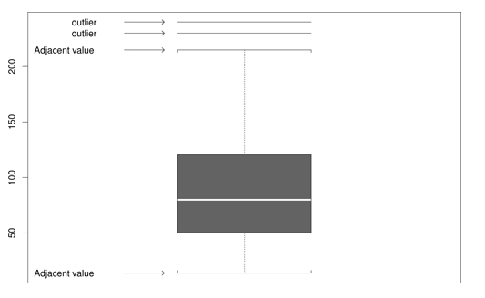

# Summaries of Data

```{r generate-freeze-02}
# Store all variables up to this line. 
# Later generated variables will be deleted after the end of each chapter
freeze <- ls()
```

The following text is not a complete excerpt or summary of chapter 2. On the one hand, I will only write down those things that are new for me and not covered in other introductory statistics textbooks. On the other side, I am exploring the presented concepts, and on this occasion, I will using and practicing R.

## Measures of Locations

### Definition and examples

The standard description of a "measure of location" as a number intended to reflect the typical individual or thing under study is misleading. A more accurate definition is that a measure of location has to satisfy three properties (p.25):

* It always lies between the largest and smallest value inclusive.
* If values are multiplied by a constant, the measures of location are multiplied with this figure as well.
* If you add a constant to every data, then the measures of location is increased by this amount too. 

Measures of locations are:

#### The sample mean 

With R, you calculate the sample mean with the built-in function `mean(x)`. This measure is susceptible to outliers. 

> One way of quantifying the sensitivity of the sample mean to outliers is with the so-called _finite sample breakdown point_ … [which] is the smallest proportion of observations that can make it arbitrary large or small. Said another way, the finite sample breakdown point of the sample mean is the smallest proportion of _n_ observations that can render it meaningless. A single observation can make the sample mean arbitrarily large or small, regardless of what the other values might be, so its finite sample breakdown point is _1/n_. (p.19)


The name _breakdown point_ refers to the maximal amount of variation the measure can withstand before it breaks down, i.e., before it can take arbitrary values^[Perret-Gentil, C., & Victoria-Feser, M.-P. (2003). Financial Valuation and Risk Management Working Paper No. 173 Robust Mean-Variance Portfolio Selection Cédric]. 

#### The sample median {#median}

In R, you calculate the sample median with the built-in function `median(x)`. The median is the most extreme example of a trimmed mean, e.g., a mean where a specified portion of the smallest and largest values are cut and not included in the computation of the average. The finite sample breakdown point for the median is approximately 0.5, the highest possible value. 

### Critical discussion

> Based on the single criterion of having a high breakdown point, the median beats the mean. But it is not being suggested that the mean is always inappropriate when extreme values occur (p.21).

Take, for example, a researcher reporting that the median amount of earnings over ten years is $100,000.This statement sounds good, but consider the following income situation:

100,000, 100,000, 100,000, 100,000, 100,000, 100,000, 100,000, 100,000, 100,000, -1.000,000. At the end of the ten years, the person has earned nothing but in fact, lost 100,000. Here the long term amount of earning, as expressed in the mean, is important.


```{example, label= "rel-mean",  name="The mean is still relevant"}
```

```{r example-2.1, results='hold'}
x <- c(100000, 100000, 100000, 100000, 100000, 100000, 100000,
       100000, 100000, -1000000)
mean(x)
median(x)
```

Or take the daily rainfall in Boston, Massachusetts, as another example for the appropriateness of the mean. The median is zero because no rain is typical for Boston. But, of course, it does rain in Boston sometimes.

### Trimmed mean {#trimmed-mean}

The sample median represents the most extreme amount of trimming and might trim too many values. Therefore many times, a trimmed mean performs better. Often a good choice for the routine use of a trimmed mean is 20%. In that case, 20% of the lowest and highest data are cut, i.e., are not included in the calculation of the mean. 

For the R standard function `mean()` the default trim parameter is 0, which corresponds to the sample mean, e.g., no trimming is carried out. To get the desired 20% in the built-in function, you have to specify `mean(x, trim=0.2)`, where the finite sample breakdown point is approximately 0.2.^[In the book, the argument mentioned for the R standard function is called wrongly `tr`.]

Wilcox provides `tmean()` especially written for the book, which has as its default trim parameter value 0.2. (`tmean(x, tr=.2)`)

### Winsorized mean {#winsorized-mean}

Later in chapter 4, the so-called winsorized mean^[See the German explication for "winsorisieren": https://m.portal.hogrefe.com/dorsch/winsorisieren/] is needed. Instead of trimming a certain percentage of the lowest and highest data, the winsorized mean set this percentage of data equal to the lowest, respectively, to the highest value, which would not have been trimmed by the trim function. Again the finite sample breakdown point equals approximately the proportion of points winsorized.


The following demonstrations show that the non-adapted mean is quite different from the median. It is almost three times bigger! You will get considerably better results with the trimmed mean and the winsorized mean.

But keep in mind that there are situations where the mean is still a very relevant measure (see Example \@ref(exm:rel-mean)).


```{theorem,  name="Comparison of mean, median, trimmed and winsorized mean"}
```

```{r compare-trim-winsorized-mean}

x_data <- c(12, 45, 23, 79, 19, 92, 30, 58, 132, 1000)
x_data_mean <- format(mean(x_data), nsmall = 2)
x_data_median <- format(median(x_data), nsmall = 2)
x_data_trim_mean <- format(mean(x_data, 0.2), nsmall = 2)
x_data_win_mean <-  with(allfun, {format(
  winmean(x_data, 0.2), nsmall = 2)
  })

x_data_tmean <- with(allfun, {format(tmean(x_data), nsmall = 2)})
```


| Measure               | Value                  | Notes
|:----------------------|-----------------------:|:-----------------------------|
| Mean                  | `r x_data_mean`        | "`r sort(x_data)`"
| Median                | `r x_data_median`      |"12, 19, 23, 30, **45**, **58**, 79, 92, 132, 1000"
| 20% trimmed mean      | `r x_data_trim_mean`   | "[12, 19], `r sort(x_data)[3:8]`, [132, 1000]"
| 20% winsorized mean   | `r x_data_win_mean`    |"23, 23, 23, 30, 45, 58, 79, 92, 92, 92"

Table: (\#tab:compare-means) Comparison of mean, median, trimmed and winsorized mean


## Measures of Variance

Not all people are alike. Even objects of the same category have more or less slightly different features. In real life, there is always variation. And it is precisely this inevitable variation, which is the motivation for sophisticated statistical techniques. We need, therefore, appropriate measures of variation, which are also called measures of scale.

### Sample Variance and Standard Deviation

* **The sample variance $s^{2}$:** Subtract the sample mean from each observation and square them. Add all differences and divide by the number of observations minus one. The build-in R function is $var(x)$.
* **The sample standard deviation $s$:** It is the positive square root of the sample variance. The build-in R function is $sd(x)$.

The sample variance is not resistant to outliers: A single unusual value can inflate the sample variance and give a misleading figure.

### The Interquartile Range

#### How to construct the IQR?

Another measure of dispersion, which is mainly used when the goal is to detect outliers, is called the interquartile range (IQR). The IQR reflects the range of values among the middle 50% of the data.

The usual way to compute it is by removing the smallest and largest 25% of the data. Then we take the difference between the largest (`q1`) and the smallest (`q2`) values remaining. $q2$ and $q1$ are called lower and upper _quartiles_, respectively. 

There are many alternative proposals for the computation of the IQR, slightly altering the calculation of the sample quantiles. The help page in R for sample quantiles records nine different types. 

#### Calculation of the _ideal fourth_

A more complicated calculation uses the so-called lower and upper _ideal fourth_.

```{definition, label="ideal-fourth",  name="Ideal fourth"}

$$q_{1} = (1 -h)X_{j} + hX_{j+1}$$

where $j$ is the integer portion of $(n/4) + (5/12)$, meaning that $J$ is $(n/4) + (5/12)$ rounded down to the nearest integer, and

$$h = \frac{n}{4} + \frac{5}{12} - j$$

The upper ideal fourth is:

$$q_{2} = (1 -h)X_{k} + hX_{k-1}$$

where $k = n - j + 1$ in which case the interquartile range is:

$$IQR = q_{2} - q_{1}$$
```


```{theorem,  name="Calculation of the ideal fourth"}


Wilcox shows the process of the computation with the following 12 values: $-29.6, -20.9, -19.7, -15.4, -8.0, -4.3, 0.8, 2.0, 6.2, 11.2, 25.0$

$$\frac{n}{4} + \frac{5}{12} = $$
$$\frac{12}{4} + \frac{5}{12} = $$
$$\frac{36}{12} + \frac{5}{12} = $$
$$\frac{41}{12} = 3.41667$$

Rounding 3.41667 to the nearest integer = `r round(3.41667)`, so h = 3.41667 - 3 = 0.41667. Because $X_{3} = -19.7$ and $X_{4} = -15.4$ we get

$$q_{1} = (1-0.41667)(-19.7) + 0.41667(-15.4) = -17.9$$
and

$$q_{2} = (1-0.41667)(-6.2) + 0.41667(2.0) = 4.45$$
So the interquartile range, based on the ideal fourth is

$$IQR = 4.45 - (-17.9) = 22.35$$

```

#### Comparison of different IQR computations

With `idealf(x)` respectively `idealfIQR` using the ideal fourths, the tenth function for the IQR computation was specially written for the Wilcox book.


```{example,  name="Compare different types of quantiles and IQRs"}
```

```{r data-to-compare-quantiles}

q <-  c(-29.6, -20.9, -19.7, -15.4, -12.3, -8.0, -4.3, 
        0.8, 2.0, 6.2, 11.2, 25.0)

```


| Function    | Quantiles: 25%, 75%                 | IQR               |
|:------------|------------------------------------:|------------------:|
| IQR, Type 1 | `r format(quantile(q,c(0.25,0.75),type=1),nsmall=2)` | `r format(IQR(q,type=1),nsmall=2)` |
| IQR, Type 2 | `r format(quantile(q,c(0.25,0.75),type=2),nsmall=2)` | `r format(IQR(q,type=2),nsmall=2)` |
| IQR, Type 3 | `r format(quantile(q,c(0.25,0.75),type=3),nsmall=2)` | `r format(IQR(q,type=3),nsmall=2)` |
| IQR, Type 4 | `r format(quantile(q,c(0.25,0.75),type=4),nsmall=2)` | `r format(IQR(q,type=4),nsmall=2)` |
| IQR, Type 5 | `r format(quantile(q,c(0.25,0.75),type=5),nsmall=2)` | `r format(IQR(q,type=5),nsmall=2)` |
| IQR, Type 6 | `r format(quantile(q,c(0.25,0.75),type=6),nsmall=2)` | `r format(IQR(q,type=6),nsmall=2)` |
| IQR, Type 7 | `r format(quantile(q,c(0.25,0.75),type=7),nsmall=2)` | `r format(IQR(q,type=7),nsmall=2)` |
| IQR, Type 8 | `r format(quantile(q,c(0.25,0.75),type=8),nsmall=2)` | `r format(IQR(q,type=8),nsmall=2)` |
| IQR, Type 9 | `r format(quantile(q,c(0.25,0.75),type=9),nsmall=2)` | `r format(IQR(q,type=9),nsmall=2)` |
| idealf / idealfIQR| `r with(allfun, {format(idealf(q)$ql,nsmall=2)})`, `r with(allfun, {format(idealf(q)$qu,nsmall=2)})`                 | `r with(allfun, {format(idealfIQR(q),nsmall=2)})`  |

Table: (\#tab:IQR-types) Comparison of the different types for IQR computation

The table compares the different computation for the IQR. R uses as standard `type = 7`. Note that `type = 8` corresponds exactly to the ideal fourth calculation.

### Winsorized Variance

When working with the trimmed mean, the winsorized variance plays an important role. The winsorized variance is just the sample variance of the winsorized values. Its finite sample breakdown point is equal to the amount winsorized.

The R function `winvar` is especially written for the book and takes of its default 0.2. `winvar(x, tr = 0.2, na.rm = FALSE, STAND = NULL)`^[The parameter `STAND` has no functionality, it is only kept for WRS compatibility purposes.]


```{example  name="Calcuation of the Winsorized Variance"}
```


```{r winvar-example}
x_data <- c(12, 45, 23, 79, 19, 92, 30, 58, 132)
var_win_0.2 <- with(allfun, {format(winvar(x_data), nsmall = 2)})
var_win_0.0 <- with(allfun, {format(winvar(x_data, tr = 0), nsmall = 2)})
var_std <-  format(var(x_data), nsmall = 2)

```

The default 20% winsorized variance calculated with `winvar(x)` = **`r var_win_0.2`**. The standard sample variance _s^2^_ is `var(x)` = **`r var_std`** and this is exactly the value one gets calculated with `winvar(x, tr = 0)` = **`r var_win_0.0`**. Typically the winsorized variance is smaller than the sample variance _s^2^_ calculated with `var(x)`, because winsorizing pulls in extreme values. 

### Median Absolute Deviation (MAD)

The median absolute deviation (MAD) is another measure of dispersions and plays an important role when trying to detect outliers. 


```{definition label="MAD",  name="Median Absolute Deviation (MAD)"}

There are three steps for its calculation. I will demonstrate these three steps with the figures from the example above,. eg., with the values $12, 45, 23, 79, 19, 92, 30, 58, 132$:
  

1. Compute the sample Median _M_. (After sorting the values $12, 19, 23, 30, 45, 58, 79, 92, 132$ you get  _M_ = 45.
2. Substract this value ($45$) from every observed value and take the aboslute value. (For instance:
$X_1 - M = |12 - 45| = 33$ and $|X_2 - M| = 0$. All values are: $33, 0, 22, 34, 26, 47, 15, 13, 87$.)
3. MAD is the median of this new list of values: $26$.

```


For reasons related to the normal distribution, MAD is typically corrected by a specific factor, namely multiplied by $0.6745$ or divided by $1.4826$. The result is sometimes called `MADN` to differentiate this value form the uncorrected `MAD`.

R has a built-in function `mad()` which calculates MADN.

```{example, label="calc-mad",  name="Calculation of the Median Absolute Deviation with `mad`"}
```


```{r calculate-madn}
x_data <- c(12, 45, 23, 79, 19, 92, 30, 58, 132)
x_mad <- mad(x_data)
x_madn1 <- mad(x_data) * 0.6745
x_madn2 <- mad(x_data) / 1.4826
```

The calculated MAD = **`r format(x_mad, nsmall=2)`** but to get MADN this value is divided by the factor `1.4826`, resulting in **`r format(x_madn2, nsmall=2)`** exactly ---  or as mentioned in the Wilcox book --- multiplied by `0.6745` with the same value of **`r format(x_madn1, nsmall=2)`**.

### Other robust measures of variation

There are many (~ 150) other measures of dispersion. Two well-performing measures are the _biweight midvariance_ and the _percentage bend midvariance_. More recently, there are some new measures in the discussion, such as the _translated biweight S (TBS)_ estimator^[I couldn't find the TBS measure of variation `tbsvar()` in any of the packages recommended in the book. But maybe it is included in the C-version, which I didn't manage to download.] and the _tau measure of scale_.

In contrast to the other measures already described, these new measures follow a different approach: Basically, MAD or winsorized variance considers only the middle portion of the data, whereas the four measures mentioned in this section try to detect outliers and then to discard them from the calculation.

The R-functions for these measures are: 

* Percentage Bend Midvariance: `pbvar()`
* Biweight Midvariance: `bivar()`
* Tau measure of scale: `tauvar()`
* Translated Biweight S: `(tbs())$var`


```{lemma, label="other-disp-measures",  name="Other dispersion measures"}
```

```{r other_dispersions-measures, echo=FALSE}

# Because of the unique code format in the following example (see: next chunk)
# I have here to include the complete code of the functions
# Otherwise my loop in the example chunk would not work

pbvar <- function(x, beta = .2) {
  #   Compute the percentage bend midvariance
  #
  #   beta is the bending constant for omega sub N.
  #
  pbvar = 0
  x = elimna(x)
  w <- abs(x - median(x))
  w <- sort(w)
  m <- floor((1 - beta) * length(x) + .5)
  omega <- w[m]
  if (omega > 0) {
    y <- (x - median(x)) / omega
    z <- ifelse(y > 1, 1, y)
    z <- ifelse(z < (-1), -1, z)
    pbvar <-
      length(x) * omega ^ 2 * sum(z ^ 2) / (length(x[abs(y) < 1])) ^
      2
  }
  pbvar
}


bivar <- function(x) {
  # compute biweight midvariance of x
  m <- median(x)
  u <- abs((x - m) / (9 * qnorm(.75) * mad(x)))
  av <- ifelse(u < 1, 1, 0)
  top <- length(x) * sum(av * (x - m) ^ 2 * (1 - u ^ 2) ^ 4)
  bot <- sum(av * (1 - u ^ 2) * (1 - 5 * u ^ 2))
  bi <- top / bot ^ 2
  bi
}


tauloc <- function(x, cval = 4.5) {
  #
  # Compute the tau measure of location as described in
  # Yohai and Zamar (JASA, 83, 406-413).
  #
  x <- elimna(x)
  s <- qnorm(.75) * mad(x)
  y <- (x - median(x)) / s
  W <- (1 - (y / cval) ^ 2) ^ 2
  flag <- (abs(W) > cval)
  W[flag] <- 0
  val <- sum(W * x) / sum(W)
  val
}

tauvar <- function(x, cval = 3) {
  #
  # Compute the tau measure of scale as described in
  # Yohai and Zamar (JASA, 1988, 83, 406-413).
  # The computational method is described in Maronna and Zamar
  # (Technometrics, 2002, 44, 307-317)
  #  see p. 310
  #
  x <- elimna(x)
  s <- qnorm(.75) * mad(x)
  y <- (x - tauloc(x)) / s
  cvec <- rep(cval, length(x))
  W <- apply(cbind(y ^ 2, cvec ^ 2), 1, FUN = "min")
  val <- s ^ 2 * sum(W) / length(x)
  val
}


tbs <- function(x,
                eps = 1e-3,
                maxiter = 20,
                r = .45,
                alpha = .05,
                init.est = OGK) {
  #        Rocke's contrained s-estimator
  #
  #      r=.45 is the breakdown point
  #      alpha=.05 is the asymptotic rejection probability.
  #
  library(MASS)
  x <- elimna(x)
  x = as.matrix(x)
  n <- nrow(x)
  p <- ncol(x)
  LIST = FALSE
  if (p == 1) {
    LIST = T
    p = 2
    x = cbind(x, rnorm(nrow(x)))
    # Yes, this code is odd, but for moment easiest way of handling p=1
  }
  temp <- init.est(x)
  #  very poor outside rate per obs under normality.
  t1 <- temp$center
  s <- temp$cov
  c1M <- cgen.bt(n, p, r, alpha, asymp = FALSE)
  c1 <- c1M$c1
  if (c1 == 0)
    c1 <- .001 #Otherwise get division by zero
  M <- c1M$M
  b0 <- erho.bt(p, c1, M)
  crit <- 100
  iter <- 1
  w1d <- rep(1, n)
  w2d <- w1d
  while ((crit > eps) & (iter <= maxiter))
  {
    t.old <- t1
    s.old <- s
    wt.old <- w1d
    v.old <- w2d
    d2 <- mahalanobis(x, center = t1, cov = s)
    d <- sqrt(d2)
    k <- ksolve.bt(d, p, c1, M, b0)
    d <- d / k
    w1d <- wt.bt(d, c1, M)
    w2d <- v.bt(d, c1, M)
    t1 <- (w1d %*% x) / sum(w1d)
    s <- s * 0
    for (i in 1:n)
    {
      xc <- as.vector(x[i, ] - t1)
      s <- s + as.numeric(w1d[i]) * (xc %o% xc)
    }
    s <- p * s / sum(w2d)
    mnorm <- sqrt(as.vector(t.old) %*% as.vector(t.old))
    snorm <- eigen(s.old)$values[1]
    crit1 <- max(abs(t1 - t.old))
    #        crit <- max(crit1,crit2)
    crit <- max(abs(w1d - wt.old)) / max(w1d)
    iter <- iter + 1
  }
  if (LIST) {
    v1 = t1[1]
    v2 = s[1, 1]
    return(list(center = v1, var = v2))
  }
  if (!LIST)
    return(list(center = t1, cov = s))
}

OGK <- function(x,
                niter = 2,
                beta = .9,
                control) {
  #
  #  OGK estimator via the R package rrcov
  #
  library(rrcov)
  v = CovOgk(x, niter = niter, beta = beta, control)
  list(center = v@center, cov = v@cov)
}

cgen.bt <- function(n, p, r, alpha, asymp = FALSE) {
    #   find constants c1 and M that gives a specified breakdown r
    #   and rejection point alpha
    if (asymp == FALSE) {
        if (r > (n - p) / (2 * n))
            r <- (n - p) / (2 * n)
    }
    # maximum achievable breakdown
    #
    #   if rejection is not achievable, use c1=0 and best rejection
    #
    limvec <- rejpt.bt.lim(p, r)
    if (1 - limvec[2] <= alpha)
    {
        c1 <- 0
        M <- sqrt(qchisq(1 - alpha, p))
    }
    else
    {
        c1.plus.M <- sqrt(qchisq(1 - alpha, p))
        M <- sqrt(p)
        c1 <- c1.plus.M - M
        iter <- 1
        crit <- 100
        eps <- 1e-5
        while ((crit > eps) & (iter < 100))
        {
            deps <- 1e-4
            M.old <- M
            c1.old <- c1
            er <- erho.bt(p, c1, M)
            fc <- er - r * (M ^ 2 / 2 + c1 * (5 * c1 + 16 * M) / 30)
            fcc1 <- (erho.bt(p, c1 + deps, M) - er) / deps
            fcM  <- (erho.bt(p, c1, M + deps) - er) / deps
            fcp <- fcM - fcc1 - r * (M - (5 * c1 + 16 * M) / 30 + c1 * 9 / 30)
            M <- M - fc / fcp
            if (M >= c1.plus.M) {
                M <- (M.old + c1.plus.M) / 2
            }
            c1 <- c1.plus.M - M
            #        if (M-c1 < 0)  M <- c1.old+(M.old-c1.old)/2
            crit <- abs(fc)
            iter <- iter + 1
        }
    }
    list(c1 = c1, M = M, r1 = r)
}

rejpt.bt.lim <- function(p, r) {
    #   find p-value of translated biweight limit c
    #   that gives a specified breakdown
    c1 <- 2 * p
    iter <- 1
    crit <- 100
    eps <- 1e-5
    while ((crit > eps) & (iter < 100))
    {
        c1.old <- c1
        fc <- erho.bt.lim(p, c1) - c1 ^ 2 * r
        fcp <- erho.bt.lim.p(p, c1) - 2 * c1 * r
        c1 <- c1 - fc / fcp
        if (c1 < 0)
            c1 <- c1.old / 2
        crit <- abs(fc)
        iter <- iter + 1
    }
    return(c(c1, pchisq(c1 ^ 2, p), log10(1 - pchisq(c1 ^ 2, p))))
}

erho.bt.lim <- function(p, c1)
  #   expectation of rho(d) under chi-squared p
  return(chi.int(p, 2, c1) + c1 ^ 2 * chi.int2(p, 0, c1))

chi.int.p <- function(p, a, c1)
  return(exp(lgamma((p + a) / 2) - lgamma(p / 2)) * 2 ^ {
    a / 2
  } * dchisq(c1 ^ 2, p + a) * 2 * c1)


chi.int2.p <- function(p, a, c1)
  return(-exp(lgamma((p + a) / 2) - lgamma(p / 2)) * 2 ^ {
    a / 2
  } * dchisq(c1 ^ 2, p + a) * 2 * c1)

out <- function(x,
                cov.fun = cov.mve,
                xlab = "X",
                ylab = "Y",
                qval = .975,
                crit = NULL,
                plotit = FALSE,
                ...) {
  #
  #  Search for outliers using robust measures of location and scatter,
  #  which are used to compute robust analogs of Mahalanobis distance.
  #
  #  x is an n by p matrix or a vector of data.
  #
  #  The function returns the values flagged as an outlier plus
  #  the (row) number where the data point is stored.
  #  If x is a vector, out.id=4 indicates that the fourth observation
  #  is an outlier and outval=123 indicates that 123 is the value.
  #  If x is a matrix, out.id=4 indicates that the fourth row of
  #  the matrix is an outlier and outval reports the corresponding
  #  values.
  #
  #  The function also returns the distance of the
  #  points identified as outliers
  #  in the variable dis.
  #
  #  For bivariate data, if plotit=TRUE, plot points and circle outliers.
  #
  #  cov.fun determines how the measure of scatter is estimated.
  #  Possible choices are
  #  cov.mve (the MVE estimate)
  #  cov.mcd (the MCD estimate)
  #  covmba2 (the MBA or median ball algorithm)
  #  rmba  (an adjustment of MBA suggested by D. Olive)
  #  cov.roc (Rocke's TBS estimator)
  #
  #  plotit=FALSE used to avoid problems when other functions in WRS call
  #  this function
  #
  library(MASS)
  oldSeed <- .Random.seed
  set.seed(12)
  if (is.data.frame(x))
    x = as.matrix(x)
  if (is.list(x))
    stop("Data cannot be stored in list mode")
  nrem = nrow(as.matrix(x))
  if (!is.matrix(x)) {
    dis <- (x - median(x, na.rm = TRUE)) ^ 2 / mad(x, na.rm = TRUE) ^ 2
    if (is.null(crit))
      crit <- sqrt(qchisq(.975, 1))
    vec <- c(1:length(x))
  }
  if (is.matrix(x)) {
    mve <- cov.fun(elimna(x))
    dis <- mahalanobis(x, mve$center, mve$cov)
    if (is.null(crit))
      crit <- sqrt(qchisq(.975, ncol(x)))
    vec <- c(1:nrow(x))
  }
  dis[is.na(dis)] = 0
  dis <- sqrt(dis)
  chk <- ifelse(dis > crit, 1, 0)
  id <- vec[chk == 1]
  keep <- vec[chk == 0]
  if (is.matrix(x)) {
    if (ncol(x) == 2 && plotit) {
      plot(x[, 1],
           x[, 2],
           xlab = xlab,
           ylab = ylab,
           type = "n")
      flag <- rep(TRUE, nrow(x))
      flag[id] <- FALSE
      points(x[flag, 1], x[flag, 2])
      if (sum(!flag) > 0)
        points(x[!flag, 1], x[!flag, 2], pch = "*")
    }
  }
  if (!is.matrix(x))
    outval <- x[id]
  if (is.matrix(x))
    outval <- x[id, ]
  n = nrow(as.matrix(x))
  n.out = length(id)
  assign(x = '.Random.seed',
         value = oldSeed,
         envir = .GlobalEnv)
  list(
    n = n,
    n.out = n.out,
    out.val = outval,
    out.id = id,
    keep = keep,
    dis = dis,
    crit = crit
  )
}


outtbs <- function(x,
                   SEED = FALSE,
                   plotit = TRUE,
                   xlab = "X",
                   ylab = "Y",
                   ...) {
  #
  # Use the tbs estimator to
  # determine which points are outliers
  #
  if (!is.matrix(x))
    stop("x should be a matrix")
  x <- elimna(x)
  temp <- out(
    x,
    cov.fun = tbs,
    plotit = plotit,
    SEED = SEED,
    xlab = xlab,
    ylab = ylab
  )
  outid <- temp$out.id
  keep <- temp$keep
  list(out.id = outid,
       keep = keep,
       distances = temp$dis)
}


elimna <- function(m) {
  #
  # remove any rows of data having missing values
  #
  if (is.null(dim(m)))
    m <- as.matrix(m)
  ikeep <- c(1:nrow(m))
  for (i in 1:nrow(m))
    if (sum(is.na(m[i,]) >= 1))
      ikeep[i] <- 0
  elimna <- m[ikeep[ikeep >= 1], ]
  elimna
}

```


```{example, label="comp-disp-measures",  name="Comparison of other robust measures of variation"}
```


```{r comp-dispersion-measures}
library(magrittr)

vecs <- list(c("Vector W", "Vector X", "Vector Y", "Vector Z"))
measures <- list(c("pbvar", "bivar", "tauvar", "tbs"))
vars <- list(c("V1","V2","V3","V4","V5","V6","V7","V8","V9"))

m1 <- matrix(c(12, 45, 23, 79, 19, 92, 30, 58, 132,
              12, 45, 23, 79, 19, 92, 30, 58, 1000,
              12, 45, 23, 79, 19, 1000, 30, 58, 1000,
              12, 45, 23, 1000, 19, 1000, 30, 58, 1000),
            nrow = 4, ncol = 9, byrow = TRUE,
            dimnames = c(vecs, vars))

m2 <- matrix(data = NA, nrow = 4, ncol = 4, byrow = FALSE,
             dimnames = c(vecs, measures))

for (i in c("pbvar", "bivar", "tauvar")) {
  for (j in 1:4) {
  m2[,i] <- apply(m1, 1, i)
  }
}

# special treatment of tbs as it does not return a single value, but a list
# the same program lines gives different results! Why?

# browser()
# 
for (j in 1:4) {
  m2[j, 4] <- tbs(m1[j, ])$var
}
m <-  cbind(m1, m2)
m %>%
  kable(caption = "Comparison of other robust measures of variation",
      label = "other-disp-measure") %>%
  kable_styling(bootstrap_options =
                  c("striped", "hover", "condensed", "responsive"),
                  font_size = 14, full_width = TRUE) %>%
  column_spec(11:14, bold = T, color = "white", background = "gray")

```

For the following interpretation, we are not interested in the magnitude of these dispersion measures, because we only want to compare their performance them with the different size and number of outliers in the four vectors W, X, Y, Z.

The table demonstrates: 

1. The `pbvar()` ignores the default parameter of the bending constant of 0.2, the two largest and smallest values. Therefore it is entirely robust with two outliers and does not change its value. But with more than two outliers on one side (small or large), its performance cause havoc: The value of pbvar in the `Vector Z`-column is strikingly different from the other values. In that case, the bending constant has to be enlarged. For instance: Changing the constant from .2 to .3 results in `pbvar()` values of $2128$ for all four vectors.
2. The `bivar()` value is for the `Vector W` similar to the percentage bend midvariance `pbvar()`. But increasing the largest value $132$ and adding more outliers it decreases! The reason is that `bivar()` has $132$ not detected as an outlier in contrast to $1000$, which values are subsequently ignored.
3. The `tauvar` is robust with one to two outliers of one side of the spectrum (small or large). With more than two small or large outliers, it increases but in moderate paces.
4. The `(tbs())$var` results only in slightly changes with different sizes and numbers of outliers. One thing I do not understand: Whenever I run the program, the values for the `tbs` differ somewhat.


### Some comments on measures of variation

The preceding sections describe several measures of dispersion. But how to choose the most appropriate? The answer depends in part of the type of problem and will be addressed in the subsequent chapters.


## Detecting outliers

Detecting unusually large or small values can be very important. The standard methods based on the sample mean and variance are sometimes highly unsatisfactory.


### Mean and variance-based method

Declare as outliers all values that are more than two standard deviations away from the mean. The reason for factor $2$ will be covered in the next chapter.

```{definition, label="std-method",  name="Method for detecting outliers based on the mean and the variance"}
```

$$\frac{|X - \bar{X}|}{s} > 2.$$ 

This formula works fine in some cases, notably, if there are not many outliers inflating the sample mean and especially the sample standard deviation. The following three examples will demonstrate one problem of outlier detection, called _masking_.

```{example,  name="Demonstration data for masking of outliers"}
```

```{r outlier-detection-mean-variance}

x.out <-  c(2, 2, 2, 2, 2, 3, 3, 3, 3, 3, 4, 4, 4, 4, 4, 1000)
y.out <- c(x.out, 10000)
z.out <- c(2, 2, 3, 3, 3, 4, 4, 4, 100000, 100000)

```


To demonstrate _masking_, Wilcox has prepared three different sets of data.

* **x.out** has one outlier: "2, 2, 2, 2, 2, 3, 3, 3, 3, 3, 4, 4, 4, 4, 4, 1000"
* **y.out** has one "normal" and one extrem outlier: "2, 2, 2, 2, 2, 3, 3, 3, 3, 3, 4, 4, 4, 4, 4, 1000, 10000"
* **z.out** has two extrem outliers: "2, 2, 2, 2, 2, 3, 3, 3, 3, 3, 4, 4, 4, 4, 4, 100000, 100000"

| # | Vector   | Outlier | **$\bar{X}$**   | **$s$**        | $> 2 sd?$                  |
|--:|:---------|--------:|----------------:|---------------:|-------------------------:|
| 1 | $x.out$  | 10^3^   | `r mean(x.out)` | `r sd(x.out)`  | `r abs(1000 - mean(x.out)) / sd(x.out)`
| 2 | $y.out1$| 10^3^   | `r mean(y.out)` | `r sd(y.out)`  | `r abs(1000 - mean(y.out)) / sd(y.out)`
| 3 | $y.out2$| 10^4^   | `r mean(y.out)` | `r sd(y.out)`  | `r abs(10000 - mean(y.out)) / sd(y.out)`
| 4 | $z.out$  | 10^5^   | `r mean(z.out)` | `r sd(z.out)`  | `r abs(100000 - mean(z.out)) / sd(z.out)`

Table: (\#tab:masking-outliers) Demonstrating the masking of outliers

* **Line 1:** The value is > 2 sample standard deviation = correct detection of outlier.
* **Line 2, 3:** The smaller outlier is masked by another more extreme outlier = no detection of the smaller outlier.
* **Line 4:** Both extreme outliers are not detected!

### The MAD-Median rule {#mad-median-rule}

The MAD-Median rule declares X as an outlier if

```{definition, label="mad-median",  name="The MAD-Median rule"}
```
$$\frac{|X - M|}{MADN} > 2.24$$

If we now substitute the formula above with the values of line 4, we get `r (100000 - median(z.out)) / mad(z.out)`, which is much bigger than 2.24. So, in this case, both outliers are detected correctly.

### R function `out(x)`

Wilcox suggests in his book the new programmed function `out(x)` for detecting outliers without the masking problem. 


```{example,  name="Demonstrate results of function `out(x)`"}
```

```{r, demonstrate-out-function}
# options(tinytex.verbose = TRUE)
with(allfun, {
  out(z.out)
})
```


`out(x)` returns a list, where I do not understand all parameter as explained in the comment inside the function. But `$out.val` returns the value all outliers and `out.id` the positions of the outliers within the vector. Trying with the above example of `z.out`: 

* Number of detected outliers: `r with(allfun, {out(z.out)$n.out})`
* The detected outliers are: `r with(allfun, {out(z.out)$out.val})` 
* Position of detected outliers: `r with(allfun, {out(z.out)$out.id})`.

The function `out(x)` detects both outliers and avoids _masking_.

### Boxplot rule

Another method to detect outliers is a graphical summary provided by a boxplot.


```{r label="boxplot", out.width="100%", echo=FALSE, fig.align="center", fig.cap="Detecting outliers with boxplot graphics (Ruediger85/CC-BY-SA-3.0/Wikimedia Commons)"}
knitr::include_graphics("images/boxplot-min.png")
```

The end of the whiskers are the smallest and largest values, not declared outliers, and are called _adjacent values_. Because the IQR has a finite sample breakdown point of 0.25, more than 25% of the data must be outliers before the problem of masking occurs.

The boxplot declares outliers if their positions are more than 1.5 IQRs from the lower, respectively, from the upper quartile.

```{definition, label="boxplot-outliers",  name="How bloxpots declare outliers"}

```

$$X < q1 - 1.5(IQR)$$

or 

$$X < q1 + 1.5(IQR)$$

For a better understanding of the boxplot measures a comparison with the probability density function of a normal distribution may be helpful:


```{r label="boxplot-PDF", out.width="70%", echo=FALSE, fig.align="center", fig.cap="Boxplots in relation to the Probability Density Function (PDF). By Jhguch at en.wikipedia, CC BY-SA 2.5, https://commons.wikimedia.org/w/index.php?curid=14524285"}
knitr::include_graphics("images/500px-Boxplot_vs_PDF.svg.png")
```

For more on boxplots, especially about the problem that the data distribution is hidden behind each box, read [Boxplot](https://www.r-graph-gallery.com/boxplot.html) and [The Boxplot and its pitfalls](https://www.data-to-viz.com/caveat/boxplot.html).

There is a built-in R function `boxplot(x)`. For a demonstration, I will use the `rivers` data again. 


```{example,  name="Demonstration of the built-in R function `boxplot(x)`"}
```


```{r boxplot-graphics, fig.cap="Demonstration of the build-in R function `boxplot(x)` with the rivers data = length of rivers", fig.align="center"}
boxplot(rivers, notch = TRUE, ylab = "Length in km", xlab = "Rivers")
```


You see several points outside the upper whisker (outside 1.5 IQR). These are the detected outliers. To get the numerical values of the boxplot Wilcox mentions `boxplot(x, plot = FALSE)` but I would recommend to use `boxplot.stats(x)`.

```{example,  name="Outliers values with the boxplot rule using `boxplot` and `boxplot.stats`"}
```

```{r boxplot-data}
sort(boxplot(rivers, plot = FALSE)$out)
boxplot.stats(rivers)
sort(boxplot.stats(rivers)$out)
```


Explanation of the result values of `boxplot.stats`:

* **stats:** a vector of length 5, containing the extreme of the lower whisker, the lower ‘hinge’, the median, the upper ‘hinge’, and the extreme of the upper whisker.
* **n:** the number of non-NA observations in the sample.
* **conf:** the lower and upper extremes of the 'notch'. These values are vital if you want to compare the medians of different sample vectors. If they do not overlap, then you can be 95% confident that the medians of the vectors differ.
* **out:** the values of any data points which lie beyond the extremes of the whiskers.

To get just a sorted list of outliers, you can write `sort(boxplot.stats(rivers)$out)` which results in: `r sort(boxplot.stats(rivers)$out)`.

### Boxplot rule modified

The proportion of detected outliers with the boxplot depends on the sample size. It is higher where the sample size is small. A modified boxplot rule solves this problem:


```{definition, label="mod-boxplot",  name="Detecting outliers with modified boxplot rule"}
```


$$X > M + kIQR$$ 

or 

$$X > M - kIQR$$
where

$$k = \frac{17.63n - 23.64}{7.74n - 3.71}$$

### R function `outbox(x)`

Wilcox has developed a function `outbox(x)` using the two different methods for detecting outliers with the boxplot method (standard and modified version).


Changing the parameter of `mbox` results in the two different methods for detecting outliers:

* **Parameter mbox = FALSE:** The function uses the standard boxplot rule.
* **Parameter mbox = TRUE:** The function uses the modified boxplot rule.

```{example, label="outbox",  name="Demonstration of the `outbox` function"}
```

```{r demo-outbox-function}
with(allfun, {
  outbox(rivers, mbox = FALSE)
})
```

The meaning of the different returned list values:

* **out.val:** I contain those values which are declared as outliers.
* **out.id:** Location of the outliers within the vector.
* **keep:** All the values not declared as outliers. This is useful if you want to store the vector without outliers in a new variable (e.g., `x_no_out = x_with_out[outbox(x_with_out)$keep]`)
* **cl:** Lower starting point for values to be declared as an outlier.
* **cu:** Upper starting point for values to be declared as an outlier.

```{example, label="cmp-outbox",  name="Compare detection of outliers with different bloxplot rules"}
```

```{r compare-outbox}
out.1 <- sort(boxplot.stats(rivers)$out)
out.2 <- sort(with(allfun, {outbox(rivers, mbox = FALSE)$out.val})) 
out.3 <- sort(with(allfun, {outbox(rivers, mbox = TRUE)$out.val}))
```

| Rule                       | List of outliers |
|:---------------------------|-----------------:|
| boxplot.stats              | `r out.1`        |
| outbox, mbox = FALSE       | `r out.2`        |
| outbox. mbox = TRUE        | `r out.3`        |

Table: (\#tab:compare-outliers) Comparing different boxplot rules for outlier detection

There are slight differences in all three variants. For me, this is surprising, particularly in the case of `boxplot.stats` and `outbox, mbox = FALSE` as these two methods should result in the same list of outliers.

### Eliminate outliers

There exist two strategies for dealing with outliers:

* Trim a specified portion of smallest and largest values. eg., [median](#median) (section \@ref(median)), [trimmed mean] (section \@ref(trimmed-mean)), [winsorized mean] (section \@ref(winsorized-mean))
* Identify and then eliminate the outliers

#### Modified one-step M-estimator (MOM) {#mom}


It checks for any outliers using the [MAD-median rule](#mad-median-rule) (section \@ref(mad-median-rule)), eliminates any outliers, and averages the remaining values.

#### One-step M-estimator


It uses a slight variation of the MAD-median rule: 


```{definition, label="one-step-m-estimator",  name="Detecting outliers with modified boxplot rule"}
```


Instead of

$$\frac{|X - M|}{MADN} > 2.24$$

it uses

$$\frac{|X - M|}{MADN} > 1.28$$

If the number of small outliers ($l$) is not equal to the number of large outliers ($u$), then there is another difference where the measure is adjusted by adding:

$$\frac{1.26(MADN)(u-l)}{n-u-l}$$

#### Functions `onestep(x)` and `mom`


Wilcox illustrates both measures with the following data set:

$$77, 87, 88, 114, 151, 210, 219, 246, 253, 262, 296, 299, 306, 376, 428, 515, 666, 1310, 2611$$

```{example, label="onestep-mom",  name="Comparing functions `onestep` and `mom`"}
```

```{r calc-onestep-mom}
x.m <- c(77, 87, 88, 114, 151, 210, 219, 246, 253, 262, 
        296, 299, 306, 376, 428, 515, 666, 1310, 2611)
mean(x.m)
median(x.m)
format(with(allfun, {onestep(x.m)}), nsmall = 2)
format(with(allfun, {mom(x.m)}), nsmall = 2)
```


### Summary

Generally, outliers harm the calculation. But keep in mind when omitting outliers that they are valuable and informative as they can hide some underlying structure. Do not ignore them, but explore them and try to understand respectively to explain why they exist.

## Histograms

Histograms are classical graphical tools for summarizing data. They group the data into categories and plots the corresponding frequencies. A common variation is to plot the relative frequencies instead. Histograms tell us something about the overall shape of the distribution. Sometimes they are also used to check for outliers. But generally, they are not suitable for outlier detection. There is no precise rule to tell us when a value should be considered as an outlier. Fazit: It is better to stick with the boxplot or MAD-median method, which has precise rules for outlier detection.

The following two graphics compares the standard R `graphics` with the newer specialized `ggplot2` package. The many program lines for the `ggplot2` graphics are necessary to get a similar result as with the simple `hist()` command. This greater complexity is an advantage as it allows for much more precise control of the graphics' appearance.

```{example, label="hist-comp",  name="Comparison of Histograms with `hist` and `ggplot`."}
```

```{r hist-t5-mismatch-score, fig.cap='Left: Historgram with `hist`. Right: Same Histogram recreated with `ggplot`', fig.show='hold', out.width='50%', fig.width=5, fig.height=4}
library(ggplot2)
T5 <- c(0.00, 0.12, 0.16, 0.19, 0.33, 0.36, 0.38, 0.46, 0.47, 0.60, 0.61, 0.61,
        0.66, 0.67, 0.68, 0.69, 0.75, 0.77, 0.81, 0.81, 0.82, 0.87, 0.87, 0.87,
        0.91, 0.96, 0.97, 0.98, 0.98, 1.02, 1.06, 1.08, 1.08, 1.11, 1.12, 1.12,
        1.13, 1.20, 1.20, 1.32, 1.33, 1.35, 1.38, 1.38, 1.41, 1.44, 1.46, 1.51,
        1.58, 1.62, 1.66, 1.68, 1.68, 1.70, 1.78, 1.82, 1.89, 1.93, 1.94, 2.05,
        2.09, 2.16, 2.25, 2.76, 3.05)
hist(T5)


## Warning: Calling `as_tibble()` on a vector is discouraged,
## because the behavior is likely to change in the future.
## Use `tibble::enframe(name = NULL)` instead.
df <- tibble::enframe(T5, name = NULL)
ggplot(df, aes(x = value)) +
  stat_bin(binwidth = 0.5, boundary = 0.5, fill = "white", colour = "black") +
  scale_x_continuous(breaks = c(0.0, 0.5, 1.0, 1.5, 2.0, 2.5, 3.0, 3.5)) +
  theme_bw() +
  theme(plot.title = element_text(hjust = 0.5, size = 14, face = "bold"),
        panel.grid = element_blank(),
        axis.title = element_text(size = 12),
        axis.text.y = element_text(angle = 90, size = 12),
        axis.text.x = element_text(size = 12)) +
  labs(
    title = "Histogram of T5",
    x = "T5",
    y = "Frequency"
  )
```

When the number of observed values is relatively small, it might be sometimes better instead to present the absolute values to use the height of a spike indicating the relative values. For this graphic representation, you can use the Wilcox function `splot()`.


```{example, label="rel-freq-splot",  name="Demonstration of the r `hist` function with splot"}
```


```{r splot-example}
library(scales)
f <-  c(rep.int(1, 12), rep.int(2, 22), rep.int(3, 32), rep.int(4, 19), rep.int(5, 8))
with(allfun, {splot(f, xlab = "X", ylab = "Rel. Freq.")})

```

To compare, I have also calculated and displayed the spike demonstration with the package `ggplot2`.

```{example, label="rel-freq-ggplot2",  name="Demonstration of the r `hist` function with ggplot2"}
```

```{r spike-example-with-ggplot2}
F <- as.character(f) %>% 
  as.tibble() %>% 
  count(value) %>% 
  mutate(z = n / sum(n))

ggplot(F, aes(x = as.integer(value), y = z)) +
  geom_line() +
  scale_y_continuous(labels = percent) +
  labs(x = "X", y = "Rel. Freq.")


```

Another problem with histograms is that they are sensible about the number of outliers. In symmetric or bell-shaped distributions, a histogram of a sample of 100 observations is satisfactory, but when outliers are relatively common, you would need a much bigger sample size.

## Kernel Density Estimators

Kernel density estimators are a large class of methods to improve histograms, e.g., to get a better sense of the overall shape of the data. Kernel density estimators empirically determine which observed values are close to the value of interest. They are based on some measure of variation, such as the interquartile range or the sample variance. Then the proportion of such points is computed.

This explanation is only a very rough approximation; the details go beyond the scope of the book.

Wilcox provides the functions `kdplot` and `akerd`.

## Stem-and-leaf Displays

Stem-and-leaf Displays are another method to gain some overall sense of what data are like. The following example demonstrates the technique.  The data are drawn from a study aimed at understanding how children acquire reading skills.

**Word Identification Scores:**

58,58,58,58,58,64,64,68,72,72,72,75,75,77,77,79,80,82,82,
82,82,82,84,84,85,85,90,91,91,92,93,93,93,95,95,95,95,95,
95,95,95,98,98,99,101,101,101,102,102,102,102,102,103,104,104,104,104,
104,105,105,105,105,105,107,108108,110,111,112,114,119,122,122,125,125,125,
127,129,129,132,134

The construction of the stem-and-leaf display begins by separating each value into two components. The first is the **leaf**, which, in this example, is the number in the one's position (the single digit just to the left of the decimal place). For example:

the leaf corresponding to the value 58 is 8,
the leaf corresponding to the value 64 is 4,
the leaf corresponding to the value 125 is 5.

The digits to the left of the leaf are called **stem**. Continuing with the above example:

the stem corresponding to the value 58 is 5,
the stem corresponding to the value 64 is 6,
the stem corresponding to the value 125 is 12.

To display the graph, one can use the built-in function `stem`.


```{example, label="stem1",  name="Demonstration of the stem function"}
```

```{r ex-stem1}

sx <- c(58,58,58,58,58,64,64,68,72,72,72,75,75,77,77,79,80,82,82,
        82,82,82,84,84,85,85,90,91,91,92,93,93,93,95,95,95,95,95,
        95,95,95,98,98,99,101,101,101,102,102,102,102,102,103,104,104,104,104,
        104,105,105,105,105,105,107,108,108,110,111,112,114,119,122,122,125,125,125,
        127,129,129,132,134)
stem(sx)
```

There are five children with a score of $58$, so there are five scores with a leaf of $8$. The five 8s reflect this data structure on the right side of the sign "|", which represents the level where the leaves connect with the stem. 

## Skewness

When applying classic inferential techniques, it is crucial to have symmetric data. If the data are skewed (for instance, to the right, e.g., the longer tail corresponds to the right side), serious concerns arise that require more complex modern inferential techniques. Sometimes transforming data (e.g., to take logarithms) can help. 

The above paragraph is just a warning. More about techniques to work with skewed distribution will follow in the later chapters of the book.

## Choosing a measure of location

To answer the question "how to decide which measure of location to use" in detail is not possible at this stage of knowledge. What follows are just general rules of thumb:

* The optimal measure of location depends in part of the nature of the histogram for the _entire population_ of individuals.
* When the population histogram is reasonable symmetric and light-tailed, roughly meaning outliers are relatively rare, the sample mean performs well.
* When working with a small sample size (less than 100), then extreme care should be taken as the mean of the population could be very different from the sample.
* When dealing with situations where outliers are relatively common, one should use the median or the 20% trimmed mean, _even when the population is sysmmetric_.
* When the population histogram is skewed, there are advantages to use the median or the 20% trimmed mean.

To sum up with two conclusions:

1. Always check for skewness and outliers with the methods mentioned in this chapter.
2. The 20% trimmed mean is for most practical purposes an excellent choice.

## Exercises

### Exercise 01

For the observations "21, 36, 42, 24, 25, 36, 35, 49, 32" verify that the sample mean, 20% trimmed mean, and the median are $\bar{X} = 33.33$, $\bar{X}_{t} = 32.9$, and $M = 35$.

```{exercise, label="exr-01", name="Exercise 01"}
```

```{r ex-01}
ex1 <- c(21, 36, 42, 24, 25, 36, 35, 49, 32)
X1  <-  format(round(mean(ex1), 2), nsmall = 2)
Xt1 <-  format(round(mean(ex1, trim = 0.2), 2), nsmall = 2)
M1  <-  format(round(median(ex1), 2), nsmall = 2)
```

Verify the following measures:

| Dispersion measure | Reference value | My actual value          |
|:-------------------|----------------:|-------------------------:|
| Sample mean        | 33.33           | $\bar{X}$ = `r X1`             |
| 20% trimmed mean   | 32.90           | $\bar{X}_{t}$ = `r Xt1` |
| Median    | 35.00 | $M$ = `r M1`|

### Exercise 02

Replace the highest value from vector `ex1` (= 49) with 200 and calculate the same values as in `ex1`. Verify that the sample mean is now $\bar{X} = 50.1$, but the trimmed mean and median are not changed and still $\bar{X}_{t} = 32.9$, resp. $M = 35$. What does this illustrate about the resistance of the sample mean?


```{exercise, label="exr-02", name="Exercise 02"}

```


```{r ex-2}
ex2 <- c(21, 36, 42, 24, 25, 36, 35, 200, 32)
X2  <-  format(round(mean(ex2), 2), nsmall = 2)
Xt2 <-  format(round(mean(ex2, trim = 0.2), 2), nsmall = 2)
M2  <-  format(round(median(ex2), 2), nsmall = 2)
```

Verify the following measures:

| Dispersion measure | Reference value | My actual value          |
|:-------------------|----------------:|-------------------------:|
| Sample mean        | 50.10           |$\bar{X}$ = `r X2`        |
| 20% trimmed mean   | 32.90           | $\bar{X}_{t}$ = `r Xt2`  |
| Median    | 35.00 | $M$ = `r M2`|

Despite one much bigger value, the trimmed mean and the median are resilient and have not changed, whereas the sample mean is not robust and has therefore changed a lot.

### Exercise 03

For the data in `ex1`, what is the minimum number of observations that must be altered so that the 20% trimmed mean is greater than 1000?


```{exercise, label="exr-03", name="Exercise 03"}
```

The vector ex1 has `length(ex1)`  (= `r length(ex1)`), 20% from every side = more than 1 but less than 2. So two values must be altered.


```{r ex-3}

ex3a <- c(21, 36, 42, 24, 25, 36, 35, 10000, 32)
ex3b <- c(21, 36, 10000, 24, 25, 36, 35, 10000, 32)
Xt3a <- format(round(mean(ex3a, trim = 0.2), 2), nsmall = 2)
Xt3b <- format(round(mean(ex3b, trim = 0.2), 2), nsmall = 2)
               
```

The 20% trimmed mean of `ex3a` (just one value altered) = `r Xt3a`. In contrast with `ex3b` (where two values are altered): `r Xt3b`.

### Exercise 04

Repeat the previous problem but use the median instead. What does this illustrate about the resistance of the mean, median, and trimmed mean?


```{exercise, label="exr-04", name="Exercise 04"}
```

The sorted data of `ex1` is "`r sort(ex1)`" and their median is **`r median(ex1)`**.
The median in `ex2` is still `r median(ex2)`, and the median of `ex3b` is also `r median(ex3b)`, again precisely the same value. 

You have to rise to the amount of $10.000$ more than half of the values of the data from example #1 to overcome the resistance of the median: $n = 9$, so $9 \times 0.5 = 4.5$. This result means that a substantial change in the median requires altering at least five observations. 

In contrast: The mean is changing with only one outlier, and the trimmed values change with the percentage of their trimming. The resistance of the measure is expressed in the **finite sample breakdown point**.


| Measure               | Finite sample breakdown point | 
|:----------------------|------------------------------:|
| Mean                  | 1/n   | 
| Median                | 0.50  |
| 20% trimmed mean      | 0.20  | 
| 20% winsorized mean   | 0.20  |
| sample variance + sd  | 1/n   |
| IQR                   | 0.25  |
| Winsorized variance   | 0.20  |
| MAD                   | 0.50  |
| MAD-Median rule       | 0.50  |
| Boxplot               | 0.25  |
| One step M            | 0.50  |

Table: (\#tab:breakdown-point) Comparison of finite sample breakdown points of various measures

### Exercise 05

For the observations "6, 3, 2, 7, 6, 5, 8, 9, 8, 11" verify that the sample mean, 20% trimmed meand, and median are $\bar{X} = 6.5$, $\bar{X}_{t} = 6.7$, and $M = 6.5$.


```{exercise, label="exr-05", name="Exercise 05"}
```


```{r ex-5}

ex5 <- c(6, 3, 2, 7, 6, 5, 8, 9, 8, 11)
X5  <-  format(round(mean(ex5), 2), nsmall = 2)
Xt5 <-  format(round(mean(ex5, trim = 0.2), 2), nsmall = 2)
M5  <-  format(round(median(ex5), 2), nsmall = 2)
               
```

Verification:

| Dispersion measure | Reference value | My actual value          |
|:-------------------|----------------:|-------------------------:|
| Sample mean        | 6.5           |$\bar{X}$ = `r X5`        |
| 20% trimmed mean   | 6.7           | $\bar{X}_{t}$ = `r Xt5`  |
| Median    | 6.5 | $M$ = `r M5`|

### Exercise 06

A class of fourth graders was asked to bring a pumpkin to school. Each of the 29 students counted the number of seeds in their pumpkin and the results were: 

      250, 220, 281, 247, 230, 209, 240, 160, 370, 274, 210, 204, 243,
      251, 190, 200, 130, 150, 177, 475, 221, 350, 224, 163, 272, 236, 200, 171, 98.
      
      (The data were supplied by Mrs. Capps at the La Cañada elementary school.)
Verify that the sample mean, 20% trimmed meand, and the median are $\bar{X} = 229.2$, $\bar{X}_{t} = 220.8$, and $M = 221$.


```{exercise, label="exr-06", name="Exercise 06"}
```


```{r ex-6}

ex6 <- c(250, 220, 281, 247, 230, 209, 240, 160, 370, 274, 210, 204, 243,
         251, 190, 200, 130, 150, 177, 475, 221, 350, 224, 163, 272, 236, 200, 171, 98)
X6  <-  format(round(mean(ex6), 2), nsmall = 2)
Xt6 <-  format(round(mean(ex6, trim = 0.2), 2), nsmall = 2)
M6  <-  format(round(median(ex6), 2), nsmall = 2)
```

Verification:

| Dispersion measure | Reference value | My actual value          |
|:-------------------|----------------:|-------------------------:|
| Sample mean        | 229.2           |$\bar{X}$ = `r X6`        |
| 20% trimmed mean   | 220.8           | $\bar{X}_{t}$ = `r Xt6`  |
| Median    | 221.0 | $M$ = `r M6`|

### Exercise 07

Suppose health inspectors rate sanitation conditions at restaurants on a five-point scale where a 1 indicates poor conditions and a 5 is excellent. Based on a sample of restaurants in a large city, the frequencies are found to be $f_{1} = 5$, $f_{2} = 8$, $f_{3} = 20$, $f_{4} = 32$, and $f_{5} = 23$. What is the sample size, $n$? Verify that the sample mean is $\bar{X} = 3.7$.


```{exercise, label="exr-07", name="Exercise 07"}
```

```{r ex-7}
ex7 <-  c(rep.int(1, 5), rep.int(2, 8), rep.int(3, 20), rep.int(4, 32), rep.int(5, 23))
n7 <-  length(ex7)
X7  <-  format(round(mean(ex7), 2), nsmall = 2)
```


The sample size $n$ = `r n7` and the mean $\bar{X}$ = `r X7`.

### Exercise 08

For the frequencies $f_{1} = 12$, $f_{2} = 18$, $f_{3} = 15$, $f_{4} = 10$, $f_{5} = 8$, and $f_{6} = 5$, verify that the sample mean is 3. (Here I am using another calculation provided by the Wilcox solution paper.)


```{exercise, label="exr-08", name="Exercise 08"}
```

```{r ex-8}
ex8 <-  c(12,18,15,10,8,5) 
n8  <-  sum(ex8)
x8  <-  c(1:6)
X8  <-  sum(x8 * ex8) / n8 # The sample mean
```

The sample size $n$ = `r n8` and the mean $\bar{X}$ = `r X8`.

### Exercise 09

For the observations 
    21,36,42,24,25,36,35,49,32
verify that the sample variance and the sample Winsorized variance are $s^2 = 81$, $s^2_{w} = 51.4$.

```{exercise, label="exr-09", name="Exercise 09"}
```

```{r ex-9}
ex9 <- c(21,36,42,24,25,36,35,49,32)
X9var <-  var(ex9)
X9winvar <- with(allfun, {format(winvar(ex9), nsmall = 2)})
```

The sample variance in my calculation is $s^2$ = `X9var` = `r X9var` and the sample Winsorized variance $s^2_{w}$ = `X9winvar` = `r X9winvar`.

### Exercise 10

Inthe previous example, what is the Winsorized variance if the value 49 is increased to 102, e.g., the new data vector is: 21,36,42,24,25,36,35,_102_,32.


```{exercise, label="exr-10", name="Exercise 10"}
```

```{r ex-10}
ex10 <- c(21,36,42,24,25,36,35,102,32)
X10winvar <- with(allfun, {format(winvar(ex10), nsmall = 2)})
```


The Winsorized variance remained the same = `X10winvar` = `r X10winvar`.

### Exercise 11

In general, will the Winsorized sample variance, $s^2_{w}$, be less than the sample variance, $s^2$?

Yes, because we shift the extreme values closer to the mean. This change reduces the dispersion
in the data. The mean squared distances from the mean decreases accordingly.


### Exercise 12

Among a sample of 25 participants, what is the minimum number of participants that must be altered to make the sample variance arbitrarily large?

Just a single observation as the sample breakpoint point is $1/n$.

### Exercise 13

Repeat the previous problem but for $s^2_{w}$ instead. Assume 20% Winsorization.

The sample breakdown point of the 20% Winsorized variance is 0.2. In the case of $n=25$, this would be $25 \times 0.2 = 5$. So, we need to change at least six observations to render the Winsorized variance arbitrarily large.


### Exercise 14

For the observations 
      6,3,2,7,6,5,8,9,8,11
verify that the sample variance and Winsorized variance are 7.4 and 1.8, respectively.

```{exercise, label="exr-14", name="Exercise 14"}
```

```{r ex-14}
ex14 <- c(6,3,2,7,6,5,8,9,8,11)
X14var <- var(ex14)
X14winvar <- with(allfun, {format(winvar(ex14), nsmall = 2)})
```

Verification: Sample variance = `r X14var` and Winsorized variance = `r X14winvar`.

### Exercise 15

For the data in Exercise \@ref(exr:exr-06) verify that the sample variance is 5584.9 and the winsorized sample variance is 1375.6

```{exercise, label="exr-15", name="Exercise 15"}
```

```{r ex-15}
X15var <- var(ex6)
X15winvar <- with(allfun, {winvar(ex6)})
```

Verification: Sample variance = `r X15var` and Winsorized variance = `r X15winvar`.

### Exercise 16

For the data in Excercise \@ref(exr:exr-14), determine the ideal fourths and the corresponding interquartile range.

```{exercise, label="exr-16", name="Exercise 16"}
```

```{r ex-16}
q16 <- idealf(ex14) 
iqr16 <- idealfIQR(ex14) 
```

The lower quartile `q16$ql` = `r q16$ql`.
The upper quartile `q16$qu` = `r q16$qu`.
The IQR is the difference = 3 or ìqr16` = `r iqr16`.

Note: With the Wilcox-Solution, the figures are not integers but: 

The lower quartile = 4.833333.
The upper quartile = 8.083333.
The IQR is the difference = $8.083-4.833=3.25$.

I do not know what the reason is for the difference as I am using the same functions.

### Exercise 17

For the data used in Excercise \@ref(exr:exr-06), which values would be declared outliers using the rule-based on `MAD`?

```{exercise, label="exr-17", name="Exercise 17"}
```

```{r ex-17}
ex6 <- c(250, 220, 281, 247, 230, 209, 240, 160, 370, 274, 210, 204, 243,
         251, 190, 200, 130, 150, 177, 475, 221, 350, 224, 163, 272, 236, 200, 171, 98)
X17 <-  with(allfun, {out(sort(ex6))})
X17.n <- X17$n.out
X17.val <- X17$out.val
```

For the data used in Exercise \@ref(exr:exr-06) there are `r X17.n` outliers: `r X17.val`.

### Exercise 18

Devise a method for computing the sample variance based on the frequencies, $f_x$.


#### Formula for the sample variance

$$s^2 = \frac{1}{n-1} \sum (X_{i} - \bar{X})^2$$

#### Formula for the sample variance based on frequencies

$$s^2 = \frac{n}{n-1} \sum (x_{i} - \bar{X})^2\frac{f_{x}}{n}$$

### Exercise 19

One million couples are asked how many children they have. Suppose the relative frequencies are 
$$f_{0}/n = 0.10,\, f_{1}/n = 0.20,\, f_{2}/n = 0.25,\, f_{3}/n = 0.29,\, f_{4}/n = 0.12,\, f_{5}/n = 0.04$$
Compute the sample variance.

```{exercise, label="exr-19", name="Exercise 19"}
```

```{r ex-19}
x19  <-  c(0:5)
ex19 <-  c(0.10,0.20,0.25,0.29,0.12,0.04) # relative frequencies
x19bar  <-  sum(x19 * ex19)
X19  <-  sum((x19 - x19bar)^2 * ex19) # The sample variance
```

The sample variance = `r X19`.


### Exercise 20

For a sample of participants, the relative frequencies are
$$f_{0}/n = 0.20,\, f_{1}/n = 0.4,\, f_{2}/n = 0.2,\, f_{3}/n = 0.15,\, f_{4}/n = 0.05$$
The sample mean is 1.45. Using the answer in Exercise \@ref(exercise-18), verify that the sample variance is 1.25

```{exercise, label="exr-20", name="Exercise 20"}
```

```{r ex-20}
x20  <-  c(0:4)
ex20 <-  c(0.2,0.4,0.2,0.15,0.05) # relative frequencies
x20bar  <-  sum(x20 * ex20) # calculated, but figure is already given with 1.45
X20  <-  sum((x20 - x20bar)^2 * ex20) # The sample variance
```

Verification: The sample mean is already given with 1.45. But my calculation results precisely to the same value of `r x20bar`. The sample variance is `r X20`.

### Exercise 21

@Snedecor_1967 report results from an experiment on weight gain in rats as a function of the source of protein and levels of protein. One of the groups was fed beef with a low amount of protein. The weight gains were
$$90,\, 76,\ 90,\ 64,\ 86,\ 51,\ 72,\ 90,\ 95,\ 78$$
Verify that there are no outliers among these values when using a boxplot, but there is an outlier using the MAD-median rule.

```{exercise, label="exr-21", name="Exercise 21"}
```

```{r ex-21-1, fig.cap="Graphical boxplot representation of the boxplot data.", fig.align="center"}
ex21 <-  c(90,76,90,64,86,51,72,90,95,78)
boxplot(ex21, notch = FALSE, ylab = "Weight gains in gram", xlab = "Rats")
```

The boxplot graphics shows that there are no outliers. Calculating the figures of the graph with `boxplot.stats(ex21)$stats` we get the vector `r boxplot.stats(ex21)$stats` where the figures is sequence are: 

+ the extreme of the lower whisker (`r boxplot.stats(ex21)$stats[1]`), 
+ the lower ‘hinge’ (`r boxplot.stats(ex21)$stats[2]`), 
+ the median (`r boxplot.stats(ex21)$stats[3]`), 
+ the upper ‘hinge’ (`r boxplot.stats(ex21)$stats[4]`), and 
+ the extreme of the upper whisker (`r boxplot.stats(ex21)$stats[5]`).

As there are in the data now values outside of the extremes of lower and upper whisker, there are no outliers dectected by the boxplot rule. We get the same empty list of values with the standard and modified boxplot rules via the `outbox()` function. But with the MAD-median rule we observe one outlier:

```{r ex21-2}
out21.1 <- boxplot.stats(ex21)$out
out21.2 <- with(allfun, {outbox(ex21, mbox = FALSE)$out.val})
out21.3 <- with(allfun, {outbox(ex21, mbox = TRUE)$out.val})
out21.4 <- with(allfun, {out(ex21)$out.val})
```

| Rule                       | List of outliers |
|:---------------------------|-----------------:|
| boxplot.stats              | `r out21.1`      |
| outbox, mbox = FALSE       | `r out21.2`      |
| outbox. mbox = TRUE        | `r out21.3`      |
| out                        | `r out21.4`      |

Table: (\#tab:compare-boxplot-rules) Comparing different boxplot rules with MAD-median rule for outlier detection with the data from exercise \@ref(exercise-21).

### Exercise 22

There are no outliers for the values: 
$$1,2,3,4,5,6,7,8,9,10$$
If you increase 10 to 10, then 20 would be declared an outlier by a boxplot. 

(a) If the value $9$ is also increased to $20$, would the boxplot find two outliers?
(b) If the value $8$ is also increased to $20$, would the boxplot find all three outliers?


```{exercise, label="exr-22", name="Exercise 22"}
```

```{r ex-22}
ex22.1 <- c(1,2,3,4,5,6,7,8,9,10)
ex22.2 <- c(1,2,3,4,5,6,7,8,9,20)
ex22.3 <- c(1,2,3,4,5,6,7,8,20,20)
ex22.4 <- c(1,2,3,4,5,6,7,20,20,20)
```

The following table summarizes the result with the R code `boxplot.stats(ex22.?)$out` where `?` is substituted by the variant number.

| Data                       | List of outliers |
|:---------------------------|-----------------:|
| $1,2,3,4,5,6,7,8,9,10$     | `r boxplot.stats(ex22.1)$out`      |
| $1,2,3,4,5,6,7,8,9,20$     | `r boxplot.stats(ex22.2)$out`      |
| $1,2,3,4,5,6,7,8,20,20$    | `r boxplot.stats(ex22.3)$out`      |
| $1,2,3,4,5,6,7,20,20,20$   | `r boxplot.stats(ex22.4)$out`      |

**Verification:** 

(a) Two outliers are found.
(b) No outliers are found because now the number of outliers inflates the upper quartile, which in turn in
boosts the interquartile range.

### Exercise 23

Use the result of the last exercise to come up with a general rule about how many outliers a boxplot can detect.

Because the IQR has a finite sample breakdown point of 0.25 (see table \@ref(tab:breakdown-point) inside exercise \@ref(exercise-04)), more than 25% of the data must be outliers before the problem of masking occurs. For example, when we had three outliers with $n=10$, all outliers disappeared in exercise \@ref(exercise-22).

### Exercise 24

For the data of vector `T5` in example \@ref(exm:hist-comp) verify that the value $3.05$ is an outlier based on the boxplot rule.

With the formula `boxplot.stats(T5)$out` we get correctly the value **`r boxplot.stats(T5)$out`**.

### Exercise 25

Looking at what approximately is the interquartile range? How large or small must a value be, to be declared an outlier?


```{r label="boxplot-outlier-estimation", out.width="100%", echo=FALSE, fig.align="center", fig.cap="Estimate outliers with this boxplot graphics. Copied from the Wilcox book, p.35."}

```

The upper and lower quartiles in  are approximately 125 and 50, respectively, so x is declared an outlier when
$$x > 125 + 1.5 \times (125 - 50)$$
$$x < 50  - 1.5 \times (125 - 50)$$

### Exercise 26

In a study conducted by M. Earleywine, one goal was to measure hagover symptoms after consuming a specific amount of alcohol in a laboratory setting. The resulting measures, written in ascending order, were:
$$0,0,0,0,0,0,0,0,0,0,0,0,0,0,0,0,0,0,0,0,0,0,1,2,2,2,3,3,3,6,8,9,11,11,11,12,18,32,32,41$$

Construct a histogram. Then use the functions `outbox()` and `out()` to determine which values are outliers. Additionally, comment on using the histogram as an outlier detection method.


```{exercise, label="exr-26", name="Exercise 26"}
```

```{r ex-26-1}
ex26 <- c(0,0,0,0,0,0,0,0,0,0,0,0,0,0,0,0,0,0,0,0,0,0,1,2,2,2,3,3,3,6,8,9,11,11,11,12,18,32,32,41)
hist(ex26, 
     main = "Histogram of hangover symptoms after consuming alcohol",
     xlab = "Amount of alcohol orally administered in laboratory setting")
```

```{r ex26-2}
X26.1 <- outbox(ex26)$out.val
X26.2 <- out(ex26)$out.val
```

+ With the `outbox()` function the detected outliers are: `r X26.1`.
+ Whereas with the `out()` function, all values not equal to zero are flagged as outliers: `r X26.2`.

Histograms are sensible about the number of outliers. In symmetric or bell-shaped distributions, a histogram of a sample of $100$ observations is satisfactory, but when outliers are relatively common, you would need a much bigger sample size.


```{r cleanup2, warning=FALSE, results='hide', include=FALSE}

suppressWarnings(lapply(names(sessionInfo()$otherPkgs),
                         function(pkgs)
                           detach(
                             paste0('package:', pkgs),
                             character.only = T,
                             unload = T,
                             force = T
                           )))

rm(list = setdiff(ls(), freeze))

```

